#                              Nama捏脸全流程文档  

##  功能概述  
**1**.通过使用编辑器模板（FacePup）生成的bundle，在客户端调节对应参数，可以实现用户对脸型，发型，唇色等部位自定义，生成和保存用户想要的虚拟形象的功能。而这个虚拟形象可以通过引擎实时根据人脸驱动，做出和人脸同步的表情。

##  全流程介绍  

###  基本原理  
**1**.捏脸功能基于blendshape, blendshape有一个参考模型，和两个维度（表情维度和捏脸维度）上的若干个变化模型。

**2**.参考模型是没有任何表情，保持自然状态的模型。这是blendshape的初始状态，两个维度上的变化状态都是基于这个初始状态的变化量。 

**3**.表情维度指的是：基于参考模型的若干（一般为46个）表情变化，例如：笑，哭，怒，歪嘴，张嘴等等。这个维度的作用就是提供表情的变化，对于某个特定的捏脸状态，提供对应的喜怒哀乐的表情。  

**4**.捏脸维度指的是：基于参考模型的若干（根据实际需要）部位变化，例如：鼻子变大变小，脸颊变胖变瘦，眼睛间距变大变小等等。这里一个维度关联一个且只有一个部位变化，这里需要特别说明的是，这个维度提供的就是可供用户设置参数，进行捏脸的选择范围，这里有鼻子大小的变化，那么用户即可选择对鼻子调节大小。 

**5**.混合原理：假设我们现在拥有三个捏脸维度（标准脸，大眼，瘦脸），以及对应的脸型下的46个表情（每个维度下都有46个对应的表情，这里就是标准脸46个表情，大眼睛脸46个表情，瘦脸46个表情）。 用户可以调节对应的系数，如果大眼0.5，瘦脸0.5，我们就得到了眼睛稍大，脸稍瘦的自定义脸（相对于参考模型）。 

在实时驱动中，再根据人脸表情，确定46个表情的权重系数，（假如这里是怒0.2，笑0.6，其他0）。结合捏脸系数和表情系数我们对参考模型计算一个变化量，就得到了自定义脸的表情（这里是一个眼睛稍大，瘦脸的人，又怒又笑），这样我们就完成了对用户自定义脸实时驱动的功能。  

<font color = red>总结来说，捏脸维度是客户改变脸型所需，表情维度是程序计算实时表情所需。因此，增加一个捏脸系数，需要添加对应的
捏脸模型，以及对应模型的46个表情！！！</font>  

###  资源准备  
了解了基本的原理之后，我们需要准备捏脸所需的资源文件，这里包括模型和贴图两个方面,以下描述均以Maya为例。  

**1**.贴图：模型的颜色贴图是必要的，如要支持换色功能，需要准备mask贴图。贴图资源制作请参考《P2A Art美术制作规范参考》

**2**.模型  
(1) 模型需要正确的组合，两只眼睛要分开作为两个mesh，两只眉毛放在一起作为一个mesh，牙齿和舌头也单独作为一个mesh,睫毛也是单独的mesh，头作为一个mesh。参考情况下模型应当包含以下组件：EyeRight, EyeLeft, Lash, Teeth, Tongue, Brow, Head.
(2) 参考模型及其46个表情的制作，这部分需要美术按照规范制作46个表情。  
(3) 美术制作捏脸维度模型，这里一个维度对应且仅对应一个部位的变化，例如大眼，那就是眼睛变大，其他部位保持不变（相对于参考模型来说）。  
(4) 由程序自动生成捏脸维度的46个表情，手动微调。或者直接手工制作捏脸维度下的表情。  

3.命名和资源整合  
(1) 首先对于准备好的模型，先建立blendshape，以参考模型的部件分别建立一个blendshape，如2中所述，这里应当有7个blendshape。  
<font color = red> 必须遵守的命名规范：</font>  
统一命名为xx_xx_xx..._0_0格式,这里举例：EyeRight_bs_0_0,EyeLeft_bs_0_0...,对于transform节点下面的mesh节点，还需再名称后面加上Shape，即对于每个blendshape的target，有下图：  
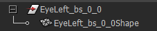  
(2) 将捏脸维度的模型的每个部件依次添加到对应的blendshape下。  
<font color = red>必须遵守的命名规范：</font>  
命名格式为xx_xx_xx..._row_0, row对应的是第几个捏脸模型,这里举例,EyeLeft_bs_1_0, EyeLeft_bs_2_0....  
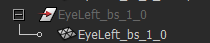   
这里transform节点和mesh节点名称须保持一致。  
(3) 添加参考模型的46个表情到对应的blendshape下。  
<font color = red>必须遵守的命名规范：</font>  
命名格式为xx_xx_xx..._0_col, col对应46个表情中的第几个,例如：EyeLeft_bs_0_1, EyeLeft_bs_0_2....  
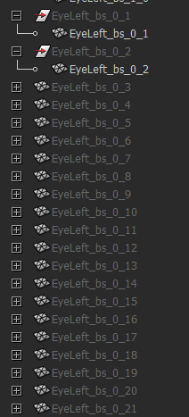   

到这里,如果你按照命名规范你会得到这样的结果：  
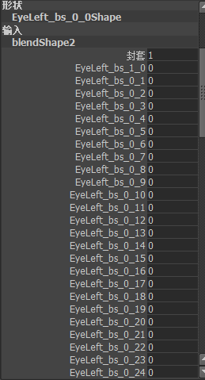  
保存,使用工具生成剩下来所需要的捏脸维度的blendshape或者手动生成。对于手动生成的模型，制作完成后，请将它们依次添加到blendshape中，并改名。  
<font color = red>必须遵守的命名规范：</font>   
对于第一个捏脸维度，格式为xx_xx_xx..._1_col, 第二个维度，xx_xx_xx..._2_col依次类推，(请按照捏脸维度顺序添加，先加第一维度的46个，再加第二维度的46个...顺序不能乱)  

### 头部Bundle制作
得到了符合标准的资源之后，我们可以开始用编辑器制作对应的bundle了。  
(1) 打开编辑器，模板选择facepup_head，新建工程，点击红圈中的加号，添加一个模型。  
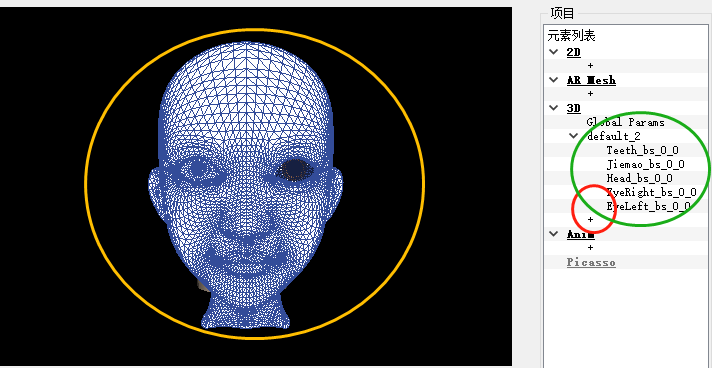   
(2) 点击下图中的红圈选择刚刚导出的fbx模型资源。  
  
(3) 导入完成之后你会看到绿圈中的mesh,这个数量应当等于上述资源准备中部件的数量。左侧窗口中会看到黄圈中参考模型的样子。  
(4) 如果发现模型的大小位置需要微调。点击下图中圈出的根节点，然后编辑右边黑色方框中的属性,position是位置，scale是缩放,rotation是旋转。  
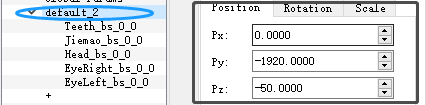    
(5) 选择某一个子部件：  
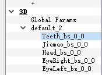  
选择对应的颜色贴图:tex_base_color, 反射贴图:env_refl_tex和tex_refl, AO贴图:tex_metallic_gloss_ao 巩膜贴图:tex_sclera（仅针对眼球），正确设置关键参数。 
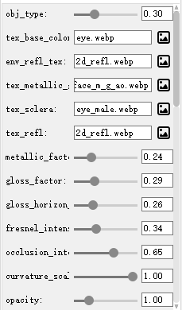  

##### 关键参数

头：颜色贴图，两张反射贴图，AO贴图，换色mask(需要换色功能的话必须有否则可以没有, 这里的换色mask必须是脸部除嘴唇外rgb为[255,0,0],嘴唇为[0,255,0])。其他保持默认即可。换色mask如下图所示


牙齿：颜色贴图，两张反射贴图，AO贴图, is_teeth 设置为1

睫毛：颜色贴图，两张反射贴图，AO贴图, is_eyelash 设置为1

眼球：颜色贴图，两张反射贴图，AO贴图, 巩膜贴图，is_eye设置为1 , 如果需要支持换色，则给一张纯白换色mask。

点击打包按钮，打包完成后点击刷新,然后开始调节参数。  
调节对应的材质参数，下面是全局参数对照表(点击global pramas出现)：  

| 参数名称 | 含义 |
| :------| :------: |
| tex_light_probe | 环境图 |
| envmap_shift | 环境图旋转角度 |
| envmap_fov | 环境图视角 |
| log_scale | 道具整体缩放比例 |
| eyeRscale | 左右眼球旋转倍率 |
| L0_yaw | 主光航向角 |
| L0_pitch | 主光俯仰角 |
| L0_R L0_G L0_B | 主光颜色 |
| L0Intensity | 主光强度 |
| L1_yaw | 补光航向角 |
| L1_pitch | 补光俯仰角 |
| L1_R L1_G L1_B | 补光颜色 |
| alphaThreshold | 透明阈值 |
| is_fix_x is_fix_y is_fix_z | 是否固定位置 |
| fixed_x fixed_y fixed_z | 固定的位置 |
| isnofacerender | 没有人脸是否绘制 |
| fixed_nx fixed_ny fixed_nz | 绘制位置 |
| use_fov | 是否启用相机fov |
| camera_fov | fov |
| rot_weight | 道具跟头幅度 |

材质参数（点击具体部件时出现）：

| 参数名称 | 含义 |
| :------| -------: |
| obj_type | [0,0.25]镂空(0.25,0.5]完全跟随(0.5,0.75]权重控制(0.75,1]跟着脑袋位移变化和大小的缩放 |
| tex_base_color | 颜色贴图 |
| env_refl_tex | 环境反射贴图 |
| tex_metallic_gloss_ao | 颜色贴图 |
| tex_sclera | 巩膜贴图 |
| tex_refl | 反射贴图 |
| metallic_factor | 金属度 |
| gloss_factor | 光滑度系数 |
| gloss_horizon_smooth | 水平视角光滑度系数 |
| fresnel_intensity | 菲涅尔强度 |
| occlusion_intensity | AO强度 |
| curvature_scale | 曲率强度 |
| opacity | 不透明度 |
| eye_type | / |
| eye_blend | / |
| tex_changemask | 换色mask |
| enable_change | / |
| color_change | / |
| satura_scale | / |
| bright_scale | / |
| is_eye | 是否是眼睛 |
| is_teeth | 是否是牙齿 |
| is_eyelash | 是否是睫毛 |
| is_hair | 是否是毛发 |
| back_cull | 是否开启背面剔除 |

##### 编辑器捏脸预览

参数调节完毕点击下图红圈中按钮，进行捏脸预览:  
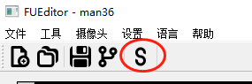  
在下图红圈中输入下列代码：  
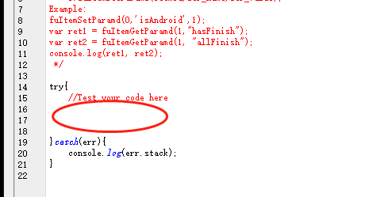   

```
fuItemSetParamd(1, "clear_facepup", 1);
fuItemSetParamd(1,"enter_facepup",1);
fuItemSetParamd(1,"\{\"name\":\"facepup\",\"param\":\"1\"\}",1);
fuItemSetParamd(1,"need_recompute_facepup",1);
```
这些代码中第一个数字需要与bundle前面的序号一样：  
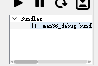   
第三行代码的第二个数字表示捏脸的维度，这个数字和资源中捏脸模型的排列顺序相同，即数字1对应xx_xx_xx..._1_0这个状态，2对应xx_xx_xx..._2_0这个状态等等。第三个数字表示对应的权重，假设我们xx_xx_xx..._1_0表示瘦脸，那fuItemSetParamd(1,"\{\"name\":\"facepup\",\"param\":\"1\"\}",0.8)就表示八成瘦。  

##### 编辑器换色预览

如上步骤，打开脚本调试,输入下列代码：

`fuItemSetParamdv(bundle序号,"channel0",[r,g,b])`

即可对脸部肤色换色，r,g,b取值范围为0-255。

`fuItemSetParamdv(bundle序号,"channel1",[r,g,b])`

即可更换唇色

`fuItemSetParamdv(bundle序号,"channel2",[r,g,b])`

即可更换眼睛颜色

示例如下：


##### 变换预览

同样进入脚本调试：

`fuItemSetParamdv(bundle序号,"localTranslate",[x,y,z])`

x,y,z为任意浮点数，这个是设置相对于道具初始点的位移

`fuItemSetParamdv(bundle序号,"absoluteTranslate",[x,y,z])`

这个设置道具在空间的绝对位移

`fuItemSetParamd(bundle序号,"localScale", x)`

x为任意大于0的数，这个设置道具相对于目前状态的缩放

`fuItemSetParamd(bundle序号,"absoluteScale", x)`

这个设置道具相对于初始状态的缩放

`fuItemSetParamd(bundle序号,"resetScale", x)`

这个还原道具的缩放

假设预览完毕后没有问题，将打包状态从测试改为发布，打包即可。如果效果有异常，可以根据下一小节的内容对资源进行调整。之后再次预览并打包。  

#### 错误排查

(1) 导入模型后，不进入捏脸状态，直接打包预览，如果这时候模型有问题，则检查序号为xx_xx_xx..._0_col,的资源, 如果是某个表情下出现错误，则根据制作时46个表情的排布，找到对应的具体表情，检查模型是否有问题。  
(2) 如果在不捏脸状态下正常，则进入捏脸状态，按照上一小节所述捏脸方法，依次检查每一个捏脸维度，如果某个表情下出现问题，同样根据(1)所述查找对应表情并修改。  
(3) 建议先在maya中用blendshape编辑器先行检查fbx资源之后再导入。  


### 头发bundle制作

#### 资源准备

头发资源制作请参考《P2A Art美术制作规范参考》

#### 编辑调整

1.打开编辑器，选择hair模板，新建工程：


2.导入制作好的模型和贴图。

必须修改的参数有：tex_albedo 颜色贴图  tex_normal 法线贴图   tex_spec 高光贴图  以及is_hair 设置为1

#### 道具接口

1.变换接口和头一致，参见头部bundle制作的"变换预览"小节

2.换色接口：

`fuItemSetParamdv(bundle序号,"channel0", [r,g,b,i])`

r,g,b为颜色参数，取值0-255，i为强度参数，取大于0的浮点数。示例如下：


注意：头发道具和头部道具的fov（global params）设置要保持一致！！！

3.预览无误之后，打包，发布。

