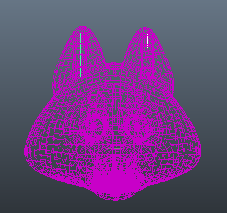
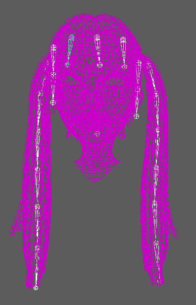
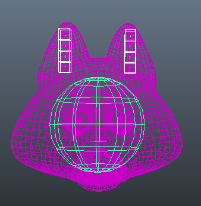
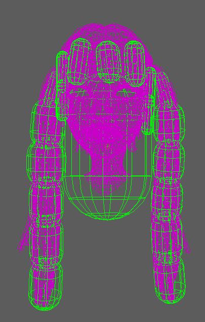
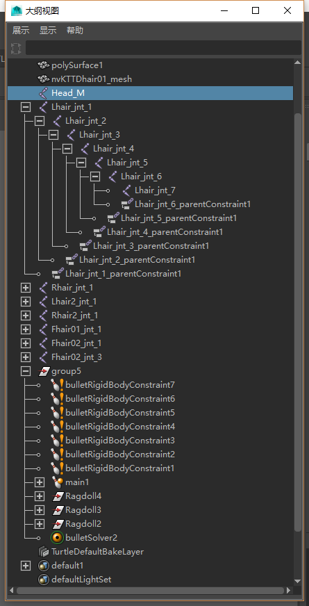
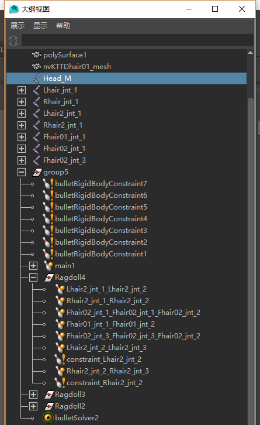
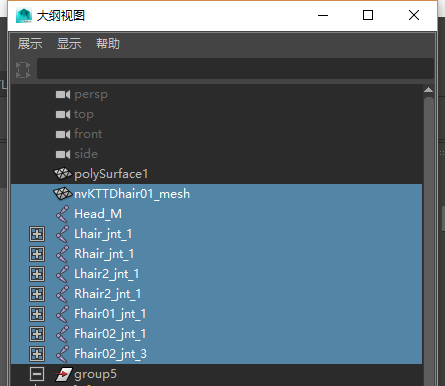
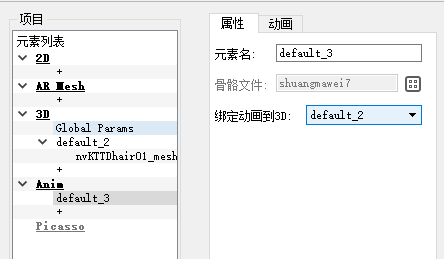
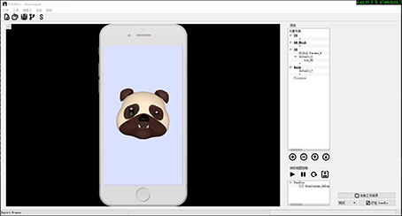

# FUEditor物理效果制作手册

1.使用maya2016制作好一个带骨骼，蒙皮的模型。

2.对需要增加物理模拟的骨骼增加刚体绑定，两者之间使用父约束进行关联。

3.建立好相应的信息后，大纲视图应该和下图类似：

4.骨骼命名如图，需要被nama的人头旋转作为输入的骨骼命名为Head_M，其余骨骼请自行安排，但请勿与现有的身体其他部位的骨骼名冲突。

5.刚体信息如上。具体参数可根据模拟需要自行进行调整，最后需要保证骨骼和刚体数量一致，并有对应的父约束将二者连接。物理模拟就可以正常运行。

6.FBX的导出，如下图选中需要导出的mesh和骨骼，点击导出当前选择，格式为fbx。

7.bullet信息的导出。加载我们提供的插件，然后选择导出全部，格式为Bullet_export。导出后的bodies.json,joints.json拷贝到FUEditor里你当前制作的工程目录fcopy底下。然后打包时导入同一个FBX的Mesh和骨骼数据，如下图：

8.就可以预览到物理动效的模拟效果了：

附件：

1.maya 里 bullet的使用教程https://c4dsky.com/9524.html

2.bullet 信息导出插件 FUEditor/data/ref/MayaPlugin_bullet_.mll

注：

1.**目前**FUEditor物理道具制作只支持单人脸识别.制作时进行多人脸识别会出现无法预估的错误。

2.头骨骼制作的位置应该与头旋转中心一致，否则会在旋转时幅度过大或过小。