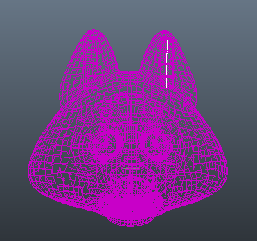
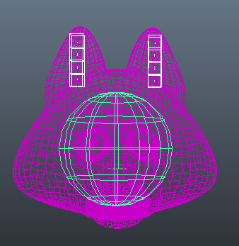
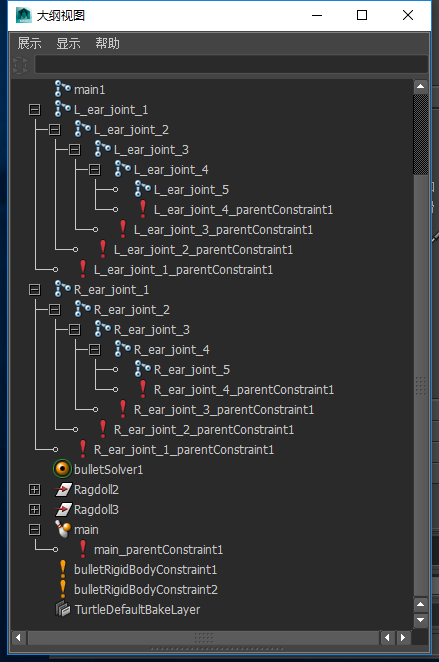
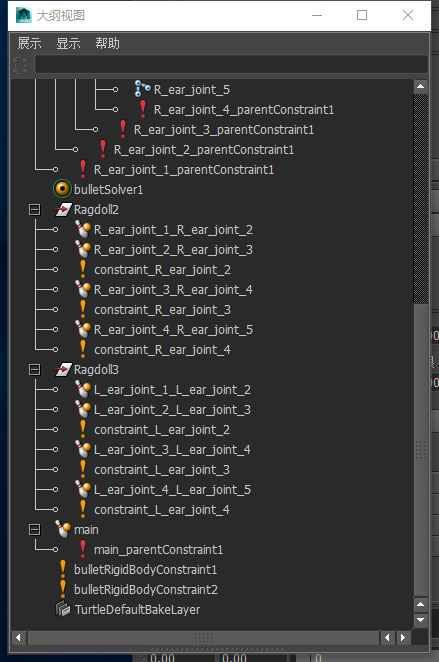
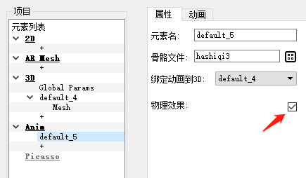

# FUEditor物理效果制作手册

1.使用maya2014制作好一个带骨骼，蒙皮的模型

2.对需要增加物理模拟的骨骼增加刚体绑定，两者之间使用父约束进行关联。

3.建立好相应的信息后，大纲视图应该和下图类似

4.骨骼命名如图，需要被nama的人头旋转作为输入的骨骼命名为main1,左耳根命名为L_ear_joint_1,右耳根命名为R_ear_joint_1。其余骨骼以此类推。

5.刚体信息如上。具体参数可根据模拟需要自行进行调整，最后需要保证骨骼和刚体数量一致，并有对应的父约束将二者连接。物理模拟就可以正常运行。

6.信息的导出，将动画帧数调为只有一帧，模型信息导出为fbx。bullet信息使用我们提供的插件，然后选择导出全部。导出后的bodies.json,joints.json拷贝到FUEditor里你当前制作的工程目录fcopy底下。然后打包时勾选物理效果

就可以预览到物理动效的模拟效果了

附件：

1.maya 里 bullet的使用教程https://c4dsky.com/9524.html

2.bullet 信息导出插件 FUEditor/data/ref/MayaPlugin_bullet_.mll

