# **FUEditor - Filter Generator 使用文档**

目录：
- [1. 程序界面的各区域介绍](#1-)
- [2. 添加操作](#2-)
- [3. 操作设置界面](#3-)
- [4. 混合模式](#4-)
- [5. 可用操作](#5-)
  - [5.1 复制图层](#5-1-)
  - [5.2 反相](#5-2-)
  - [5.3 黑白](#5-3-)
  - [5.4 填充](#5-4-)
  - [5.5 亮度/对比度](#5-5-)
  - [5.6 色相/饱和度](#5-6-)
  - [5.7 色阶（仅输入色阶）](#5-7-)
  - [5.8 曲线](#5-8-)
  - [5.8 渐变映射](#5-9-)
  - [5.10 图片](#5-10-)
  - [5.11 色板](#5-11-)
  - [5.12 循环操作](#5-12-)
  - [5.13 音乐滤镜](#5-13-)
  - [5.14 3D眼镜](#5-14-)
  - [5.15 灵魂出窍](#5-15-)
  - [5.16 马赛克](#5-16-)
  - [5.17 MPEG卡顿特效](#5-17-)
  - [5.18 边缘特效](#5-18-)
  - [5.19 老电影特效](#5-19-)
- [6. 打包道具](#6-)

## 1. 程序界面的各区域介绍
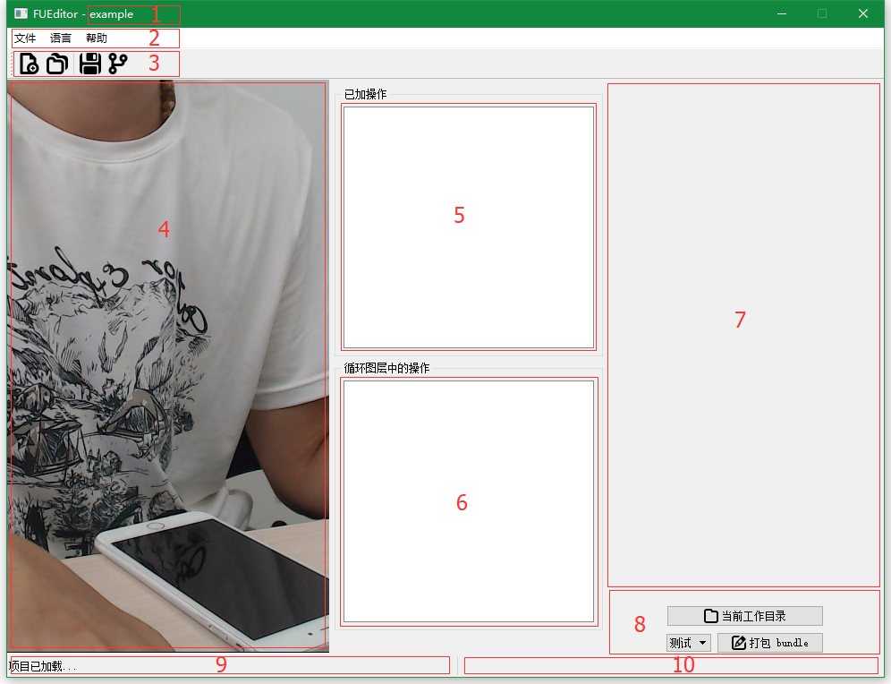

- 区域1  
   显示当前项目名；
- 区域2  
   菜单栏；
- 区域3  
   工具栏；依次为：新建、打开、保存、另存为；   
- 区域4  
   实时预览区；
- 区域5  
   当前已添加的操作；
- 区域6  
   显示循环操作；  
    仅当__区域5__选择循环操作时，此区域可用；
- 区域7  
   __区域5__或__区域6__中选中操作的相关设置；
- 区域8  
   打开当前工作目录、打包道具等功能；
- 区域9  
   打开项目、保存项目、打包bundle等操作的提示
- 区域10  
   打开项目、保存项目、打包bundle等操作的进度条


## 2. 添加操作
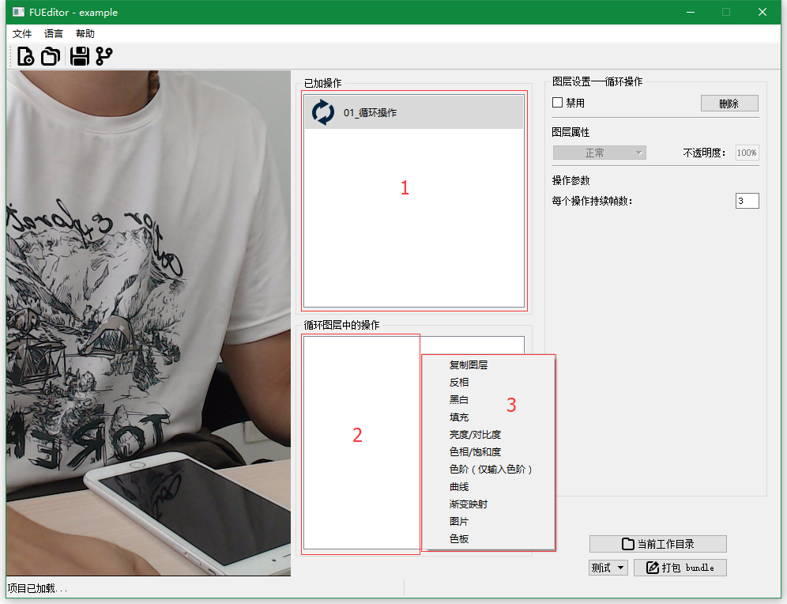

在__区域1__或__区域2__中右键，从弹出菜单（__区域3__）中选择需要添加的操作；注意，__区域1__的右键菜单中比__区域2__的右键菜单多一项循环操作。

## 3. 操作设置界面
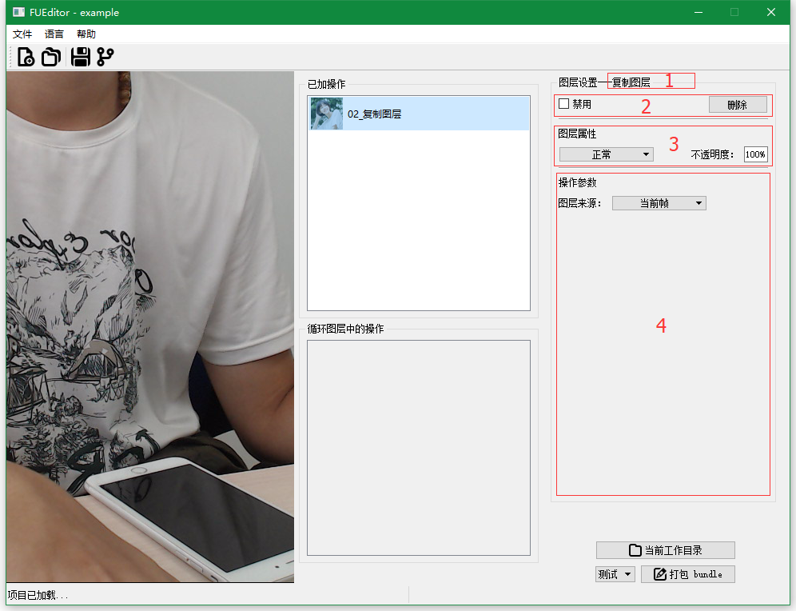

- 区域1  
   显示当前操作名；
- 区域2  
   禁用、删除当前操作。
 - 禁用：由于无法调整添加操作的顺序，所以提供禁用功能。勾选后，当前操作失效，但保留在已加操作中。（__可恢复__）
 - 删除：直接删除当前操作。（__不可恢复__）
- 区域3  
   该图层的混合模式（效果与ps一致，[支持的混合模式](#4-)）、不透明度；  
    注：若当前图层为循环操作，则此区域不可用。
- 区域4  
   当前操作的相关设置（各操作不同）；
 - 图层来源  
    某些操作是直接修改图层内容（如反相），而某些操作则是应用在当前的结果上（如曲线）；  
     图层来源的功能，相当于在ps里的__复制__图层，并对图层应用当前操作（如上图为复制当前帧，并对其进行反相操作）；
     图层编号，与__已加操作/循环图层中的操作__里的图层名称前面所带数字对应。

## 4. 混合模式
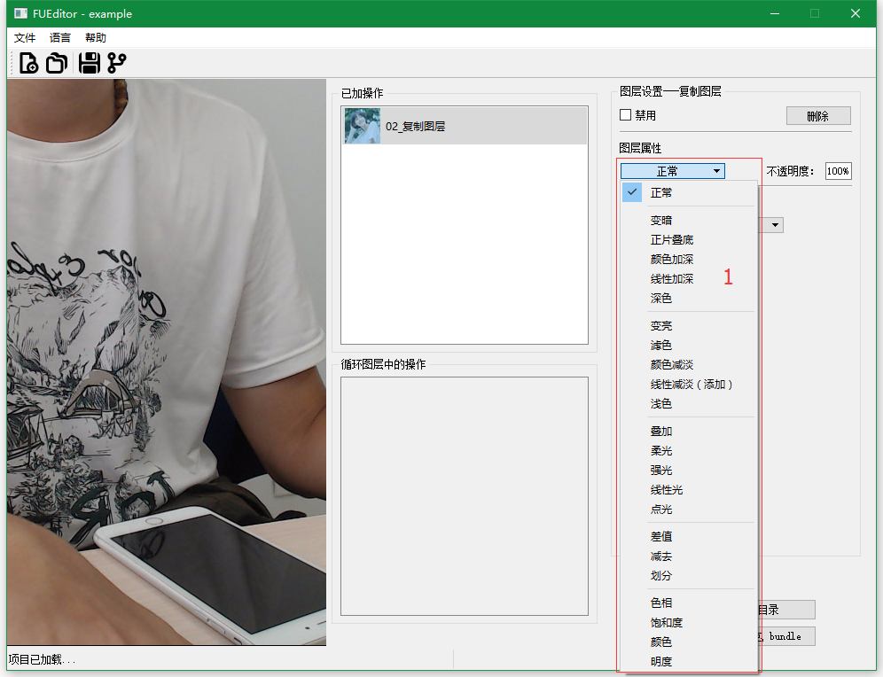

支持的混合模式有：
- 正常  
- 变暗
- 正片叠底
- 颜色加深
- 线性加深
- 深色
- 变亮
- 滤色
- 颜色减淡
- 线性减淡（添加）
- 浅色
- 叠加
- 柔光
- 强光
- 线性光
- 点光
- 差值
- 减去
- 划分
- 色相
- 饱和度
- 颜色
- 明度

## 5. 可用操作
此处介绍所有可用的操作。
#### 5.1 复制图层


功能与ps里的复制图层相同。复制的图层由上图中区域4的图层来源指定。

#### 5.2 反相
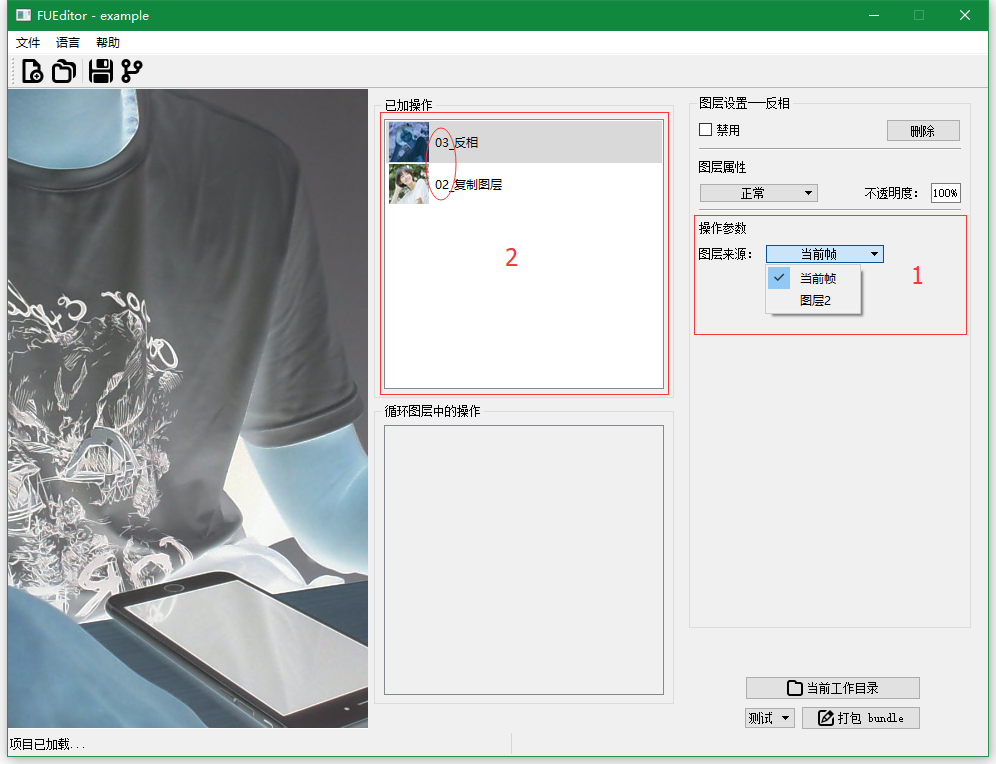

复制由上图中区域1的图层来源指定的图层，并对其进行反相操作。

#### 5.3 黑白
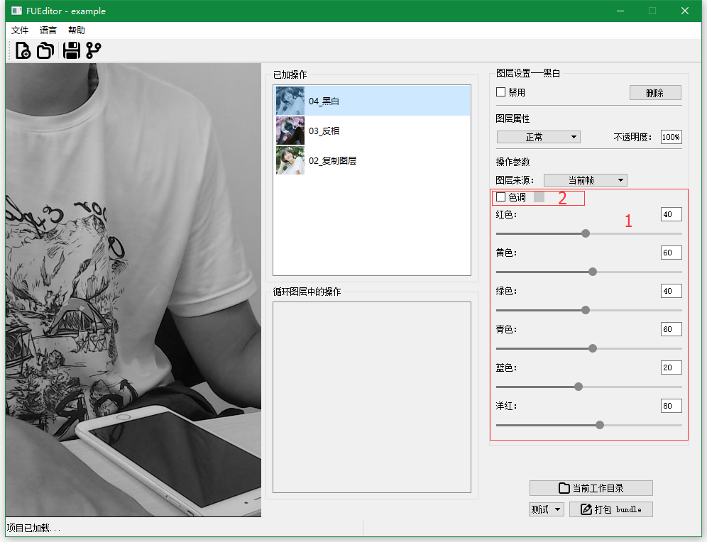

复制由图层来源指定的图层，并对其进行黑白操作。
- 区域1  
  勾选色调后，可点击灰色小块，选取颜色；
- 区域2  
  进行黑白操作所需的六个参数；

#### 5.4 填充
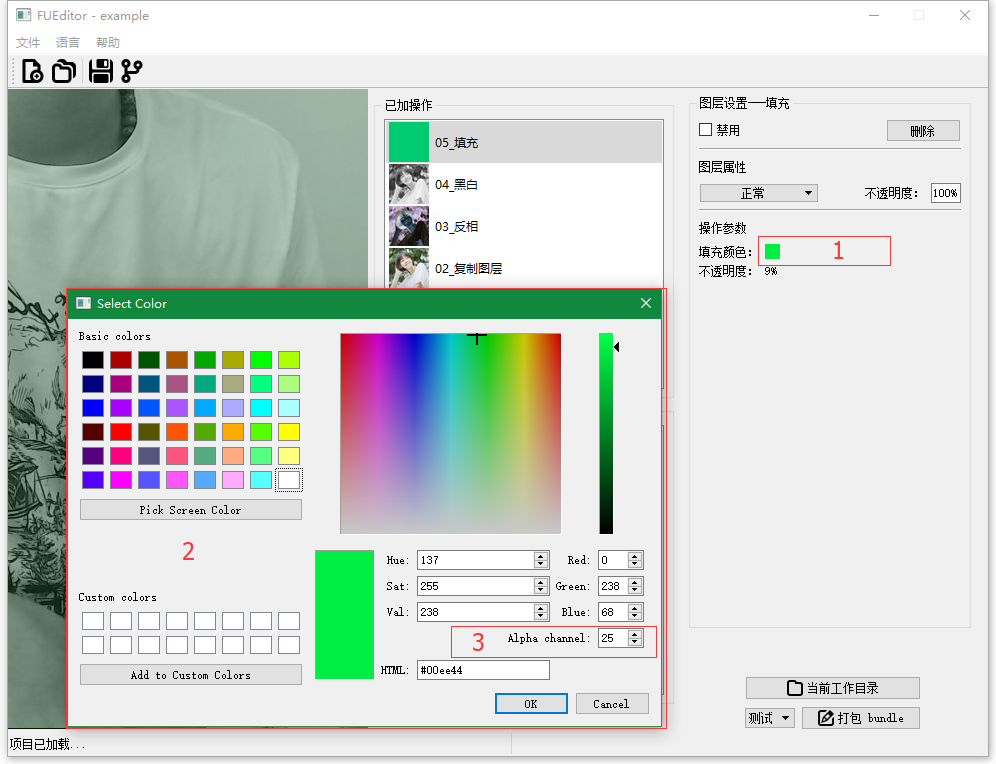

填充一个纯色图层。所填充的颜色可通过点击__区域1__进行选取。点击区域1后，会出现颜色选取对话框（区域2），其中，区域3可设置所填充颜色的透明度。

#### 5.5 亮度/对比度
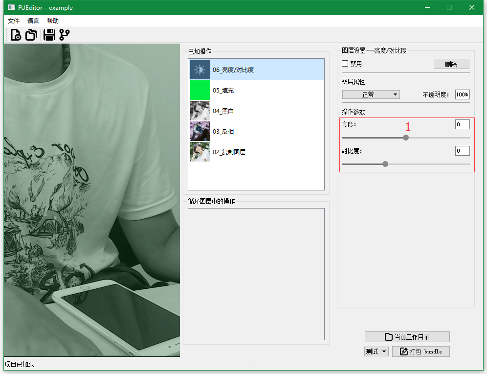

可选参数为：亮度、对比度。

#### 5.6 色相/饱和度
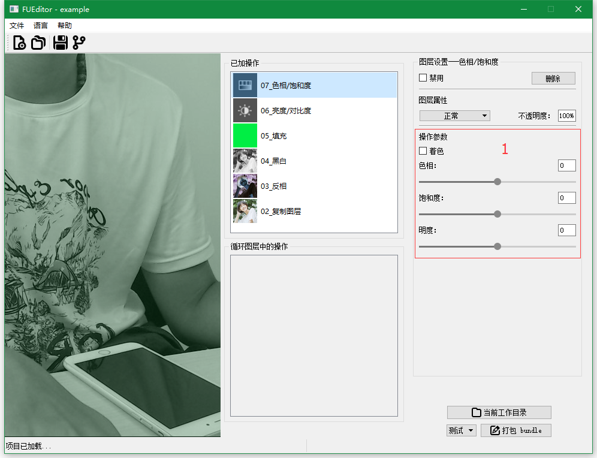

可选参数为：是否着色、色相、饱和度、明度。

#### 5.7 色阶（仅输入色阶）
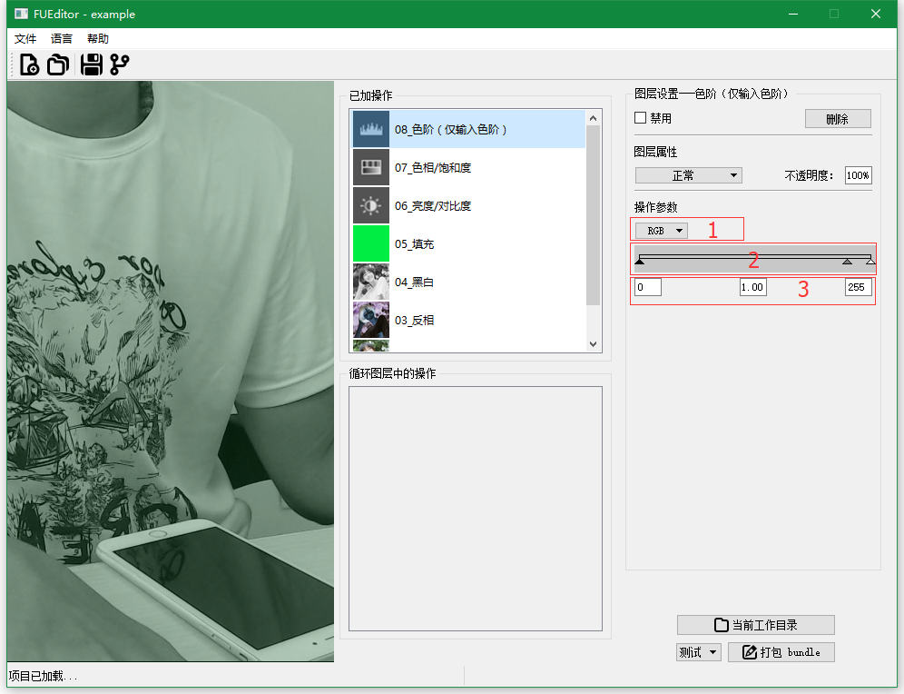

- 区域1  
  可选择不同通道（RGB、R、G、B）；
- 区域2  
  三个三角形滑块可以进行拖动，修改参数；
- 区域3  
  手动输入具体数值，修改参数；


#### 5.8 曲线
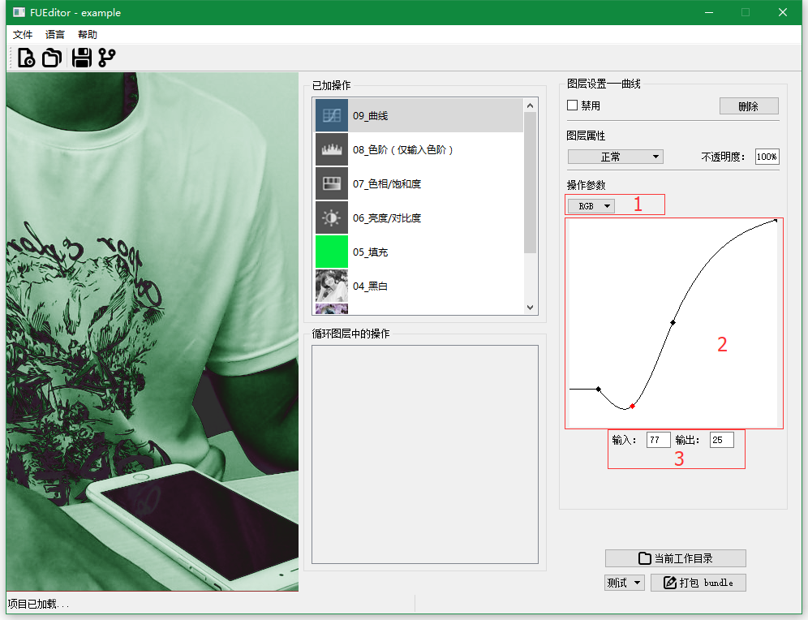

- 区域1  
  可选择不同通道（RGB、R、G、B）；
- 区域2
  - 添加点  
    点击曲线上没有点的位置；
  - 修改点  
    拖动曲线上已有的点；
  - 删除点  
    按键盘delete键；将点往左（右）拖拽至左（右）边点的左（右）边，松开鼠标；
- 区域3  
  手动输入具体数值，修改当前选中的点（红色点）参数；


#### 5.9 渐变映射
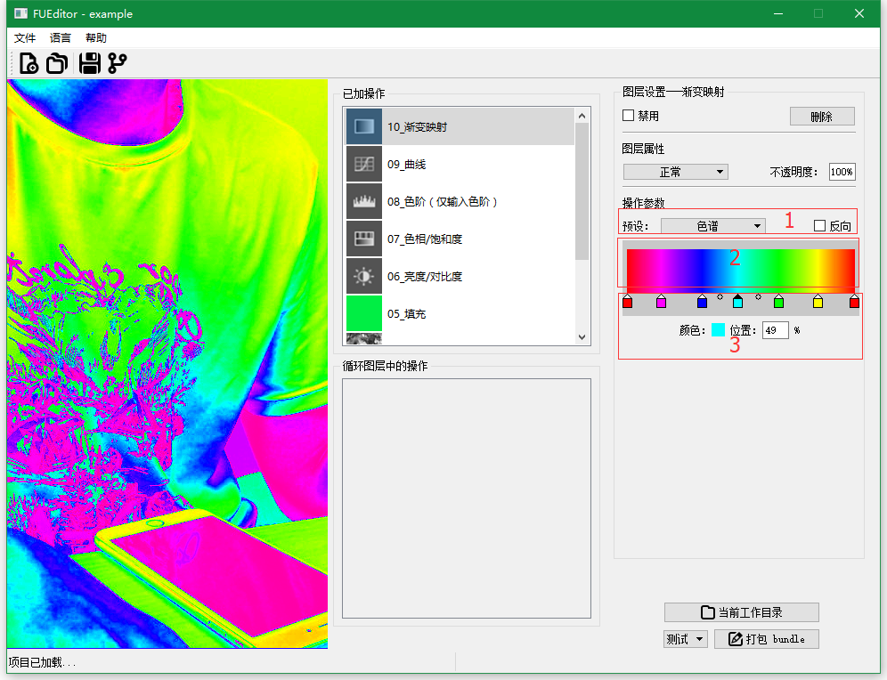

- 区域1  
  - 预设  
    提供了几个ps中的预设；
  - 反向  
    将映射反向反转；
- 区域2  
  当前映射方案的预览图；
- 区域3  
  两种形状的滑块均可以选中、滑动；  
  选中滑块后，可直接拖拽滑块，也可通过下方的输入框直接输入位置；  
  当选中__带颜色__滑块时，可通过点击文字“颜色”旁边的颜色方块进行颜色选择；

#### 5.10 图片
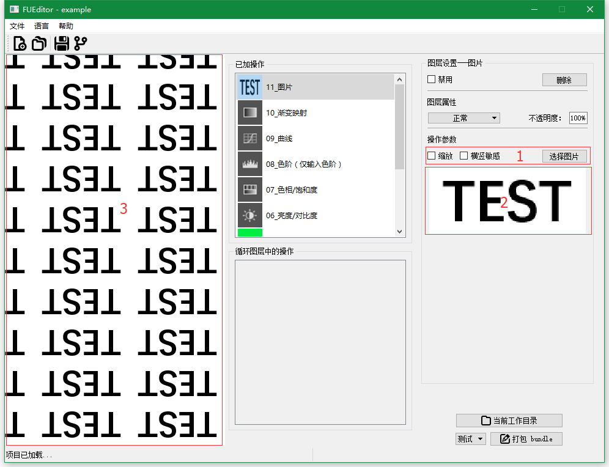

- 区域1  
  选择图片、设置图片是否缩放、是否横竖敏感；
- 区域2  
  选择的图片的预览；


+ 缩放  
  勾选后，图片会直接填充满整个画面（见下图2）；  
  取消勾选后，图片不是直接填充满整个画面，而是沿横竖两个反向进行重复复制（见下图1）；
+ 横竖敏感  
  勾选后，图片会根据当前图片和当前帧的横宽（电脑一般为宽屏）进行旋转（见下图3）；  
  取消勾选后，图片不会进行旋转（见下图2）；


注：可利用我们提供的颗粒图（data/resources/keli_1.png、data/resources/keli_2.png），图层混合模式选择正片叠底、__取消勾选缩放__，实现颗粒效果。

- 图1：输入的图比当前帧小，在__未勾选缩放__的情况下，会对图片沿横竖两个反向进行复制  


- 图2：输入的图比当前帧小，但在__勾选缩放__的情况下，直接对图片进行放大；同时，图片与当前帧反向不同（一横一竖），因为__未勾选横竖敏感__，图片宽边对应当前帧的短边，图像比例失调比较明显   

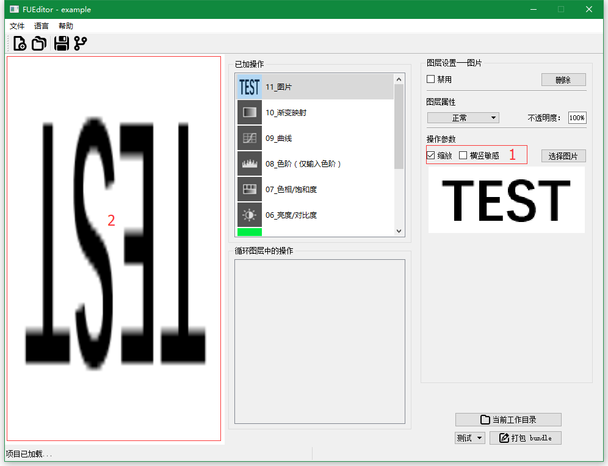

- 图3：图片与当前帧反向不同（一横一竖），但在__勾选了横竖敏感__后，对图片进行了90度旋转  

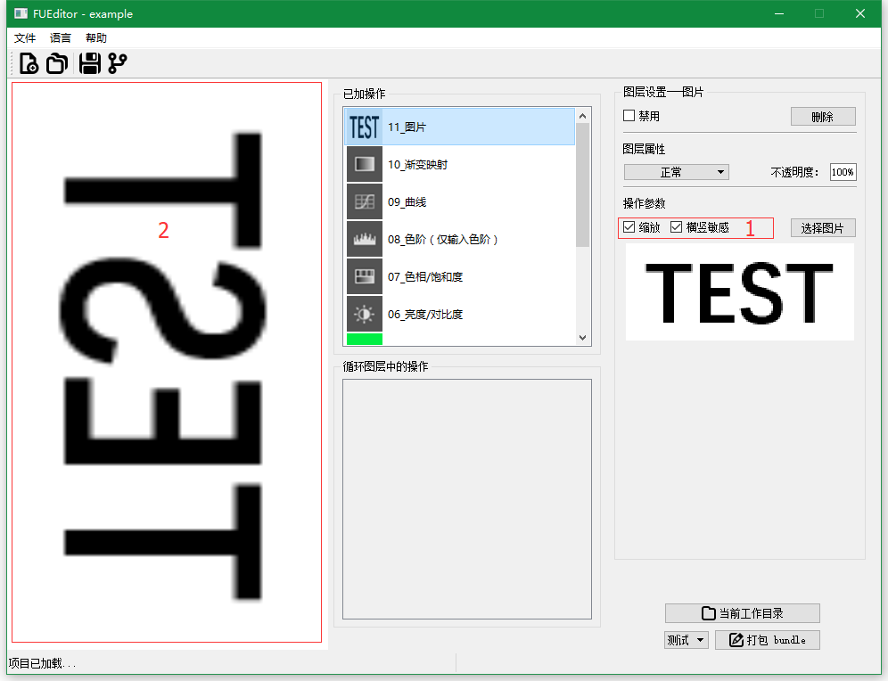

#### 5.11 色板
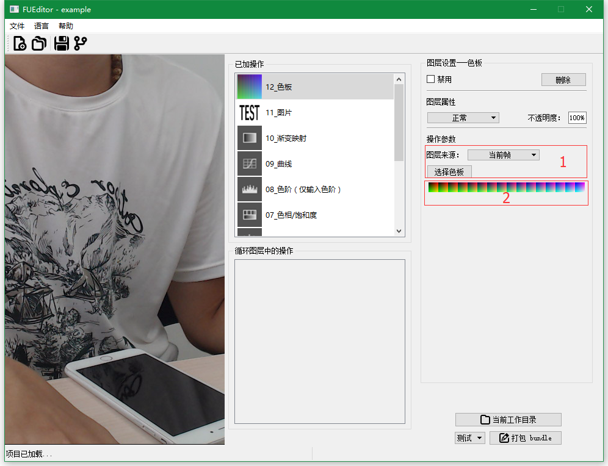

由于目前FUEditor提供的操作未覆盖ps里的所有操作，而某些情况下，又需要其他操作。我们因此提供了该功能。  

使用我们提供的原始色板（data/resources/clean_palette.png），在ps里对其进行相应的操作，在导出结果，将结果导入到该位置，可实现对应的效果。

#### 5.12 循环操作
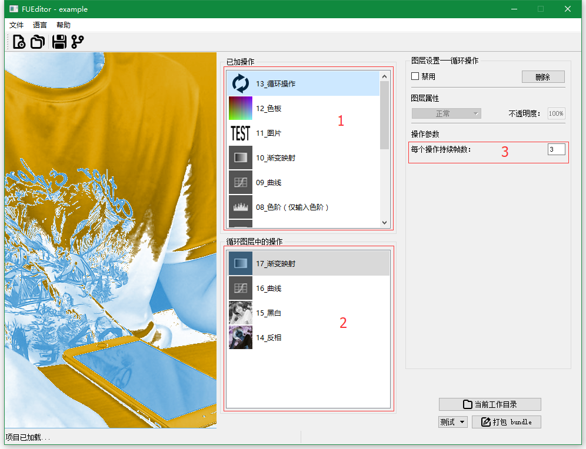

通过该操作，支持动态效果；

该操作有一个参数可设置：每个操作持续帧数，控制每个操作起作用的时间。

当在__区域1__中选中循环操作后，__区域2__变为可用状态，可以在其中添加需要切换的操作。

以上图为例说明循环的顺序：
```C
17->18->19->20->17->18->19->20……
```

若需要以下面的顺序循环，可在20后面，依次新建与19、18一模一样的操作（操作类型、混合模式、参数等）
```C
17->18->19->20->19->18->17->18……
```
#### 5.13 音乐滤镜
1. 在最上层的主功能窗口添加音乐滤镜（musicfilter）特效
  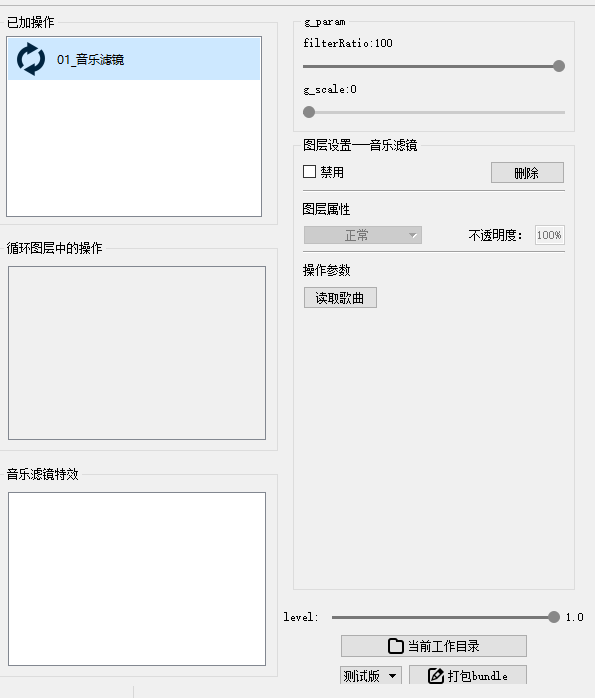
2. 在音乐滤镜特效的子窗口添加子特效，点击子特效可以调整子特效参数
  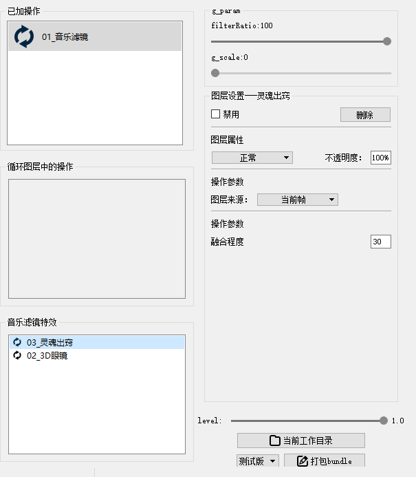
3. 选中子特效时可以滑动g_param中的filterRatio来调整子特效的程度，这个程度就是和音乐强度绑定的值。
  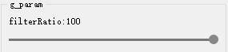
4. 选中主窗口的music filter，浏览并添加音乐，中文为读取歌曲（MP3格式）。__ 注意__：音乐所在路径不能包含空格，中文。  
  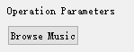
5. 打包bundle时就会根据添加的音乐的强度来生成音乐特效，特效会在音乐的鼓点（强度的波峰）处进行随机切换。
6. 注意：主功能中musicfilter不能和其他功能同时添加，如果已经添加了musicfilter其他功能将无法添加，只可以操作子窗口。

#### 5.14 3D眼镜

红蓝色偏特效。可以调节操作参数中的transform percent（位移比）来控制色偏程度。  
同时可以滑动filterRatio来调整滤镜整体程度（给音乐滤镜使用）
#### 5.15 灵魂出窍
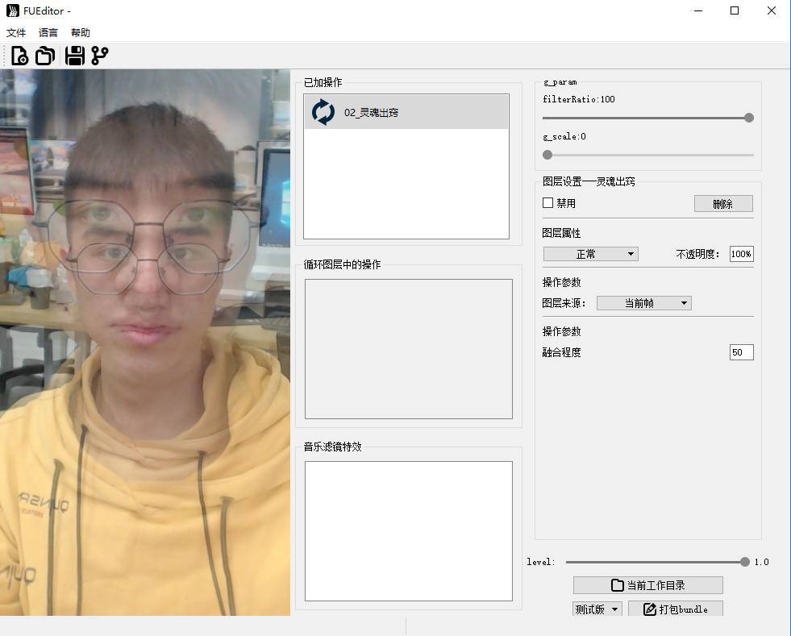
灵魂出窍特效。可以调节融合程度参数。  
同时可以滑动filterRatio来调整滤镜整体程度（给音乐滤镜使用）
#### 5.16 马赛克

马赛克特效。可以调节马赛克半径参数。  
同时可以滑动filterRatio来调整滤镜整体程度（给音乐滤镜使用）
#### 5.17 MPEG卡顿特效
MPEG卡顿特效。需要先选择加载一张噪声图片   
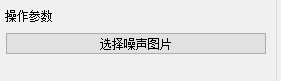   
同时可以滑动filterRatio来调整滤镜整体程度（给音乐滤镜使用）
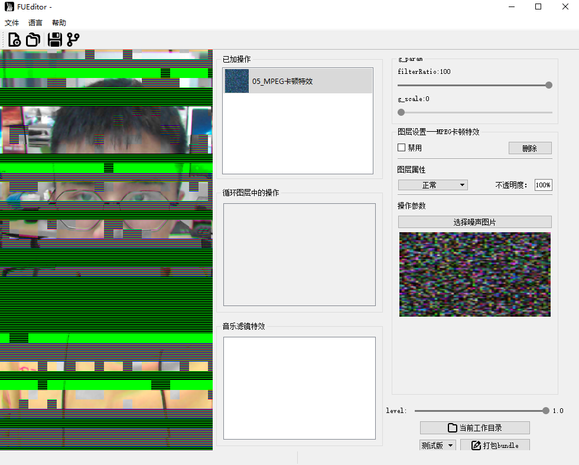  
#### 5.18 边缘特效
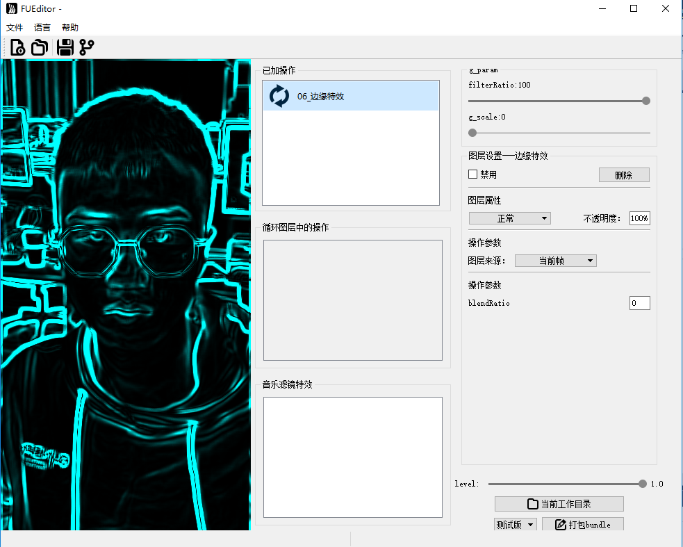
边缘特效。可以调节blendratio参数（融合程度）。  
同时可以滑动filterRatio来调整滤镜整体程度（给音乐滤镜使用）
#### 5.19 老电影特效
老电影特效。需要先选择加载一张噪声图片   
   
同时可以滑动filterRatio来调整滤镜整体程度（给音乐滤镜使用）
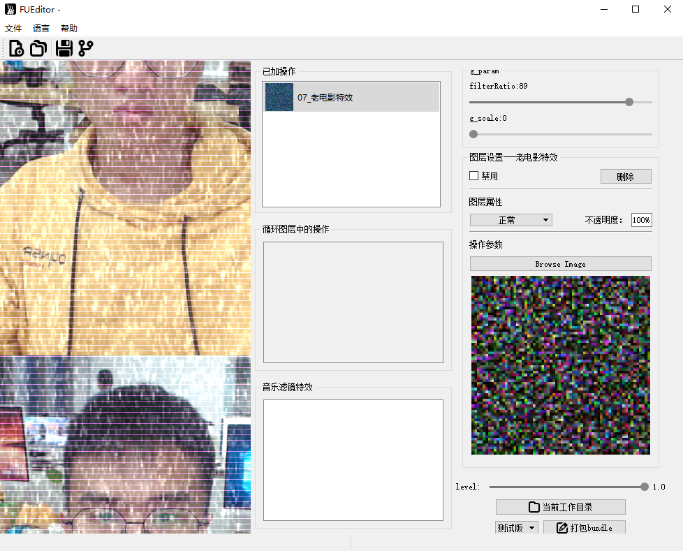  
## 6 打包道具

与FUEditor的另外两款工具（2D、3D）不同的是，视频滤镜工具打包时只有__测试__和__发布__两种模式可以选择，并且不会提供zip文件等未经打包的道具。
