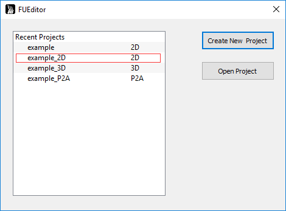
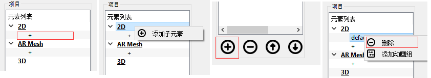
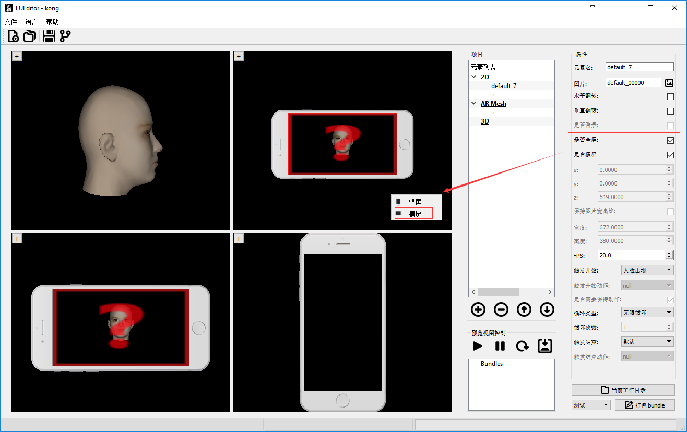
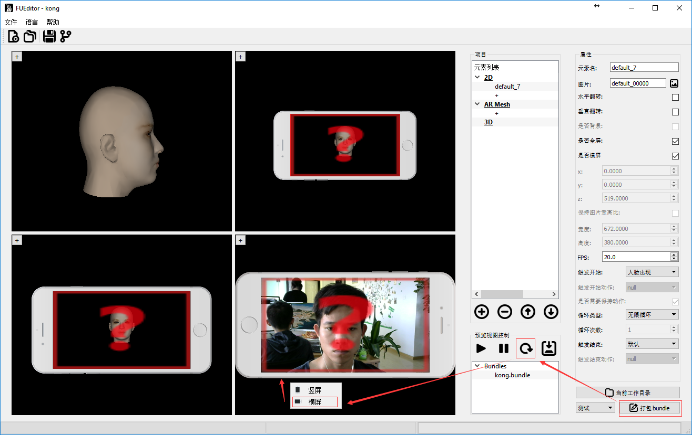
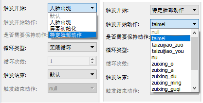
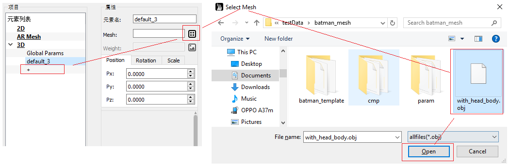

[TOC]
# **FUEditor 使用文档**

## 简介
__FUEditor__ 是一款高效便捷的AR人脸道具编辑工具软件，为[Faceunity](www.faceunity.com)公司的Nama SDK提供支持。
 - 可以高效制作2D道具。贴纸，贴纸动画，动画组，特定脸部动作触发动画。Faceunity的2D贴纸技术本质也是3D的，有前后景深效果，侧脸时仍能紧贴人脸，而不是全部贴纸都在一个平面上。
 - 可以制作AR Mesh面具。
 - 可以制作3D的道具，调整材质，如花环头盔等。  
 

## 1. 快速安装
- 系统要求  
  - win7/8/10 64位电脑
  - 摄像头，推荐使用 Logitech C920
-	FUEditor无须安装可直接使用，将FUEditor.zip解压到系统适当位置。
-	目录结构解释  
```C
+FUEdittor\          //FUEditor根目录
       -FUEditor.bat      //双击点击，启动FUEditor
       +bins\             //FUEditor程序库
       +data\             //FUEditor数据目录
       +log\              //FUEditor运行日志
       +Projects\         //所有道具项目的目录
         +daoju1\          //道具“daoju1”项目目录
           -daoju1.fuproj   //道具项目“daoju1”工程文件
           +build\          //已签名道具bundle（测试证书）
           +release\        //已签名道具bundle（正式证书）
           +zip\            //未签名压缩包
           +fcopy\          //自定义内容目录，用于自定义脚本
           +out\            //临时文件
         +daoju2           //道具“daoju2”项目目录
           -daoju2.fuproj   //道具项目“daoju2”工程文件
           ...
         +daoju3           //道具“daoju3”项目目录
           ...
```
- 启动程序  
 双击 FUEditor 目录中 FUEditor.bat 启动程序。显示最近项目列表，可以选择以前的项目，也可以新建项目。

 

- 查看example    
 FUEditor中自带一些示例项目，首次启动时，显示的项目即是示例项目，在最近项目列表中鼠标左键选择打开‘example_2D’项目。

   
 进入示例项目，点击按钮启动摄像头，点击开始预览。

   
---

## 2. 使用  
#### 2.1 新建项目  
- 创建：点击菜单__File__>>__New Project__，或者快捷键__Ctrl+N__，或者点击左上边按钮。弹出对话框，选择创建项目类型，输入项目名称

   

 创建完新项目后，界面左上角会显示__FUEditor – 项目名__，项目存放在 _FUEditor/Projects/项目名/_ 目录下。  
__注意__：所有道具项目存放在 _FUEditor/Projects_ 目录下，新建项目时不要重名。道具名称命名最好以“公司名缩写\_设计师名缩写\_道具名”规范来命名，如“fu\_crt\_maolian”。道具名最好不要和之前的一样，否则会覆盖掉之前打包好的道具。  
_FUEditor/Projects_ 目录下由程序创建的目录不要随意动。

#### 2.2 2D道具编辑
- 添加：点击2D类型下"__+__"号创建新的元素；或者在"__2D__"上右键选择"__添加子元素__"；或者选中"__2D__"，点击下面按钮添加新元素。  
- 删除：点击删除当前选中的元素。或者在元素上点右键，选择"__删除__"。  

 


- 2D元素属性：  
 修改查看元素的属性，在视窗中选择道具元素，或者再树状元素列表中选择元素，右边会显示对应的元素属性视图  

   

- 属性释意：
  - 元素名：当前元素的名称，可修改，不同元素元素名不同。
  - 图片：点击右边图片按钮，选择图片纹理。  
  __注意__：2D元素帧动画序列命名必须是“xxxx_五位数字.扩展名” 例如， xxxx_00000.png, xxxx_00001.png 帧序列。  
  即使没有帧动画，只有一帧也需命名为xxxx_00000.png。
  - 水平翻转：沿元素中心做水平翻转。
  - 垂直翻转：沿元素中心做垂直翻转。
  - 是否背景：背景元素，不会跟人脸动，不拉伸，直接绘制在屏幕。不同屏幕分辨率按照(rx,ry)在屏幕上绘制元素，(rx,ry)表示元素中心在屏幕上的比例，左上角为(0,0),右下角为(1,1)。
  - 是否全屏：全屏元素，不会跟人脸动，拉伸绘制在全屏幕。
  - 是否横屏：全屏元素，且为横屏模式，不会跟人脸动，拉伸绘制在全屏幕。参见[横屏支持]章节。
  - xyz：元素的位置，可直接输入；也可以在窗口中拖动，鼠标放到坐标轴上，按住鼠标左键拖动即可。
  - 保持图片宽高比：勾选，让元素保持原来图片的宽高比约束，调整宽或高会自动调整另一个值。取消后可自由调整宽高。
  - 宽度：元素宽度。
  - 高度：元素高度。
  - FPS：播放帧速率，每秒播放多少帧。
  - 触发开始：当前道具从什么时候开始绘制。
  - 触发开始动作：当前道具在什么人脸表情动作下触发时开始绘制。
  - 是否需要保持动作：勾选时，且触发开始为“特定人脸表情动作”时，需要人脸保持某一动作，才能持续绘制道具元素。
  - 循环类型：当前道具的循环播放类型。
  - 触发结束：但特定条件满足时，结束当前道具元素绘制。
  - 触发结束动作：当前道具在什么人脸表情动作下触发时停止绘制。  
 __注 1__：具体动画逻辑参见[动画逻辑](#)章节  
 __注 2__：背景元素以及全屏元素，在道具加载时就固定了方向，如要调整方向需要，需要在代码中调整旋转角度，调用
 ```C
 /*
 / 第一个参数为bundleid，最后参数为旋转度数 0，90，180，270。
 / 每加90度相当于逆时针旋转90度。
 */
 fuItemSetParamd(item_id, "rotationAngle",90);
 eg.
 fuItemSetParamd(item_id, "rotationAngle",90);//Android 前置
 fuItemSetParamd(item_id, "rotationAngle",270);//Android 后置
 fuItemSetParamd(item_id, "rotationAngle",0);//非Android 平台
 ```

- __横屏支持__：  
 2D属性"__是否横屏__"选择，只适用于全屏元素，勾选后。
 在预览区，点击鼠标右键，在弹出框中选择横屏预览。  
__注__：一旦预览框选择对应的预览模式后，跟预览框模式不一样的全屏元素将不显示，仅仅是不显示，切换模式后将重新显示，打包正常。   

 __注__：程序使用时，在加载道具后，默认竖屏模式，但需要切换横屏时，需要调用代码
```C
fuItemSetParamd(item_id, "isLandscape",1);     //第一个参数为bundleid，最后参数 0-竖屏 ，1-横屏。
```

 正视图/左视图/自由视图预览：  
   

 FUEditor中实时预览：  
   

#### 2.3 2D动画逻辑
单个元素，表示道具包中可编辑的最小单元。以下按照"__触发开始__"不同类型分类，描述各种不同条件下的动画逻辑。
- __触发开始__ - __人脸出现__：在出现人脸的时候，开始绘制元素，适用于需要人脸的元素。【当 "触发结束" 或者 "循环类型" 触发了结束后，暂时结束道具绘制，不管是否有人脸，当再次出现人脸时（有->无->有），再次绘制道具】。
 - 触发结束 - 默认：正常按照循环类型进行绘制。   
    - 循环类型 - 无限循环：则一直绘制该元素直到人脸消失，人脸出现时又重新绘制。
    - 循环类型 - 循环N次：循环绘制该元素N次(循环N次)，N 次后停止 该绘制该元素，暂停该道具。
    - 循环类型 - 循环1次并停留：播放道具一个循环后，停在最后一帧。
 - 触发结束 - 人脸出现：【未定义操作】
 - 触发结束 - 屏幕初始化：【未定义操作】
 - 触发结束 - 特定脸部动作：按循环类型进行绘制，如触发特定脸部动作,停止当前元素，暂停该道具。
    - 循环类型 - 无限循环：则一直绘制该元素直到人脸消失。
    - 循环类型 - 循环N次：循环绘制该元素N次(循环N次)，N次后停止该绘制该元素，暂停该道具。
    - 循环类型 - 循环1次并停留：播放该元素一个循环后，停在最后一帧。


- __触发开始__ - __屏幕初始化__：道具加载后，立即绘制，无须人脸出现，适用于一些全屏或背景元素。【当 "触发结束" 或者 "循环类型" 触发了结束后，暂时结束道具绘制，不管是否有人脸。再次从有人脸到无人脸时（有/无->有-> 无），再次绘制道具】
  - 触发结束 - 默认：无特殊触发条件，按照循环类型逻辑。
    - 循环类型 - 无限循环：一直绘制该元素，无论人脸有无。
    - 循环类型 - 循环N次： 循环绘制该元素N次(循环N次)，N次后停止该绘制该元素，暂停绘制，等待下次有脸到无脸的切换。
    - 循环类型 - 循环1次并停留：播放道具一个循环后，停在最后一帧。
  - 触发结束 - 人脸出现：当人脸出现时，暂停绘制，等待下次有脸到无 脸的切换。当没有人脸出现时，按照循环类型控制逻辑。
  - 触发结束 - 屏幕初始化【未定义操作】
  - 触发结束 - 特定脸部动作：当出现特定人脸动作时，暂停绘制，等待下次 有脸到无脸的切换。当没有人脸出现时，按照循环类型控制逻辑。


  - __触发开始__ - __特定脸部动作__：道具加载后，需等特定人脸动作FaceActtionStart出现才触发元素绘制。适用于一些与人脸表情动作相关的元素。
    - __是否需要保持动作__ 选项：优先判断条件，当勾选时，人脸需要一直做着"触发开始动作"动作，才能保持元素绘制；不勾选时只要做一次"触发开始动作"触发，便开始绘制元素，开始绘制后，逻辑按循环类型以及触发结束来。
    - 触发结束 - 默认：无特殊触发条件，按__是否需要保持__特定脸部动作优先条件判断是否绘制。如绘制按照循环类型逻辑。
      - 循环类型 - 无限循环：一直绘制该元素。
      - 循环类型 - 循环N次：循环绘制该元素N次(循环N次)，N次后停止该绘制该元素。当脸部动作"触发开始动作"再次被触发时，能够再次绘制。
      - 循环类型 - 循环1次并停留：播放道具一个循环后，停在最后一帧。
    - 触发结束 - 人脸出现【未定义操作】
    - 触发结束 - 屏幕初始化【未定义操作】
    - 触发结束 - 特定脸部动作，当出现特定人脸动作特定脸部动作End时，停止绘制元素，当脸部动作FaceActtionStart再次被触发时，再次绘制。当没有特定人脸特定脸部动作End出现时，按needtokeep特定脸部动作优先条件判断是否绘制，如果绘制按照循环类型控制逻辑。    

---
#### 2.4 特定脸部动作
当道具元素选择触发开始类型为："特定脸部动作"，然后在触发开始动作列表中选择一个动作，能够根据人脸的特定表情触发元素播放。  

  

###### 2.4.1 内置特定动作
- "taimei" 是判断用户 抬眉毛的动作  
- "taizuijiao_zuo"是判断用户 抬左边嘴角的动作  
- "taizuijiao_you"是判断用户 抬右边嘴角的动作  
- "nu"是判断用户 怒的动作  
- "zuixing_o" 为嘴型O形  
- "zuixing_a" 为嘴型A形   
- "zuixing_du" 为嘴型嘟嘴形状  
- "zuixing_min" 为嘴型抿嘴形状  
- "zuixing_guqi" 为嘴型鼓气形状   
- "biyan_zuo" 为闭左眼  
- "biyan_you" 为闭右眼   
- "zhuantou_zuo" 为头往左边转   
- "zhuantou_you" 为头往右边转  


###### 2.4.2 自定义脸部动作
其中 "触发开始动作" 用户可以自定义。定义动作的文件为FUEditor/data/tools/actions.json。文件内容如下，是一个json文件，actions是一个数组，定义了上面图中所示的动作列表，每一个动作有name属性，name最终会显示在界面上。condition属性为具体判断条件，这里的condition是js脚本的条件语句。params.expression数长度为46，对应的46个表情通道，具体对应《Blendshape制作教程》。
例如
```
{
    "actions": [
        {
            "name": "taimei",
            "condition": "params.expression[16] >= 0.4 || params.expression[17] >= 0.4 || params.expression[18] >= 0.4"
        },
        {
            "name": "taizuijiao_zuo",
            "condition": "params.expression[24] >= 0.4 || params.expression[28] >= 0.4"
        },
        ………..
    ]
}
```


---
#### 2.5 组动画
###### 2.5.1 添加组动画
创建组：  
   
 创建子元素：  
   
###### 2.5.2 元素组构成
元素组由组的根节点以及组内元素构成：

- 组的根节点，控制该组动画逻辑，组的动画逻辑如上定义单个元素的控制逻辑。
- 组内元素，只能设置在当前组内循环次数N，循环结束后，开始组内下一节点的动画。
- 组内最后一个元素，可以设置在当前组内循环次数N，循环结束后重新进入根节点逻辑；也可以设置为"无限循环"，这样前面的元素播放完后，开始无限循环最后一个，例入一群蝴蝶往头上飞，到头上后停在头上煽动翅膀，飞动画播放一次，停下来煽动无限循环。

###### 2.5.3 调整组元素顺序
组动画的播放顺序由在元素列表先后顺序决定，点击右键可以调整元素前后关系  

   

- - -

## 3. AR Mesh 制作
AR Mesh 是拟合人脸的一个3D的mesh, 当需要制作"面具"，可以使用该功能。

- 创建：点击列表中"AR Mesh"下"+"创建新的元素。
- 删除：右键点击"删除"删除当前选中的元素。
- 调整：可以通过右键调整元素的先后顺序。  
__注__：支持多层 AR mesh，前后关系由在序列中先后顺序决定。  

AR Mesh 纹理制作方法：
- 方法一：可以使用 FUEditor/data/ref/ar_demo3.obj 在 3d max/maya 等工具中进行 UV 映射，制作贴图。
- 方法二：参考 FUEditor/data/ref/ default_ar.png 或 reference_head.png，根据 UV 图 FUEditor/data/ref/ ar-uv.png （半透明可叠加）在 PS 等工具中制作贴图。  

## 4. 静态3D道具制作
Faceunity Nama SDK拥有实时跟踪三维人脸的能力，能够实时推算人脸在相机空间中的坐标以及人头的三维模型。所以可以根据[参考人头](#8- )制作3D道具。obj原模型放在"_FUEditor/data/ref/ar_demo3_",制作3D模型时可以参考该模型大小进行制作。首先要制作模型准备素材，再使用FUEditor进行预览打包，以及调整材质。
#### 4.1 道具制作
- 模型制作  
  根据参考人头obj，在3D Max/Maya等三维建模软件中制作想要的道具,最后导出obj文件。下面以maya为例，
  1. 一定要导出材质和组  
  材质在导出之后肯定是要重新调整过的，但是编辑器仍然需要知道 Maya 里哪些面 绑的材质是一样的，哪些面是不一样的。要不然到编辑器里所有的面就会合到一起， 不能分开调了。组也是一样的道理。  
  __注__：一个组内只能使用一个材质。      
     

  2. 一定要对着参考人头调好模型大小，对于道具更要调整好位置  
  导入参考人头到maya中  
    
  编辑器有一定的位置和大小调整功能，但如果道具小了/大了几十倍上百倍肯定就不行了。  
    

- 创建3D项目  
  1. 点击创建项目，项目类型选择3D，输入项目名称，点击"OK"创建项目。  
     

  2. 创建新的3D元素：在项目"__元素列表__"中点击"__3D__"类别下"__+__"，创建新的3D元素。  
  3. 加载obj：在"__属性列表__"中，网格项中点击右边按钮，在弹出对话框中选择需要加载的obj。  
       

     
   __注__：在导出的obj的材质mtl，最好也导出贴图信息，并确保路径正确。

#### 4.2 材质调整
FUEditor默认采用"__GGX__"光照模型。  
在预览视图中选择要调整的部件或者在项目列表选择部件。选中右边会显示该部件的属性信息。  
在项目列表中选择"__Global Params__",右边会显示全局参数属性信息。    
- 全局参数  
  - "tex_light_probe":环境图  
  - "envmap_shift"：环境图的旋转角度  
  - "envmap_fov": 环境图的视角
  - "log_scale"：道具整体缩放的比例，用对数调节是为了方便  
  - "eyeRscale"：眼球左右旋转的倍率
  - "L0_yaw"：主光的航向角，也就是左右转的那个角  
  - "L0_pitch" 主光的俯仰角，也就是上下转的那个角  
  - "L0_R"：主光的颜色，R通道  
  - "L0_G"：主光的颜色，G通道  
  - "L0_B"：主光的颜色，B通道  
  - "L0Intensity": 主光的强度，用对数调还是为了方便
  - "L1_yaw"：补光的航向角，也就是左右转的那个角
  - "L1_pitch"：补光的俯仰角，也就是上下转的那个角
  - "L1_R"：补光的颜色，R通道  
  - "L1_G"：补光的颜色，G通道  
  - "L1_B"：补光的颜色，B通道  
  - "TexFPS"：贴图动画的帧率，需要子部件的 tex_albedo 选择成动画帧 xxx_00000.png, xxx_00001.png ...    
  - "L1Intensity": 主光的强度，用对数调还是为了方便
  - "alphaThreshold"：半透明算法阈值，设为1.0适合普通简单的半透明物体，设为0.5适合头发。
- 部件材质参数：
  - "obj_type":物体的类型
    - 一是镂空[0,0.25]
    - 二是会完全随着脑袋旋转和缩放,(0.25,0.5]
    - 三是权重控制旋转的幅度（前提是有对应主obj的weight.png,例如aa.obj对应的权重贴图是aa_weight.png）,(0.5,0.75]
    - 四是只会跟着脑袋位移变化和大小的缩放，例如身体(0.75,1]。  
  - "tex_normal": 法向贴图，就是蓝了吧唧的那种，不是bump map哦～bump map要先转一下哦～～ 默认的grey.png等于没有贴图  
  - "normal_strength"：法向贴图的强度，为了照顾没有法向贴图的模型，强度默认是0，所以设了法向贴图之后要把强度拽高点才能看到效果  
  - "tex_albedo"：颜色贴图，会自动加载obj对应材质库mtl中Ka_map，如没有Ka_map,默认的white.png是白的，需要选择部件对应的贴图。如要做出3D贴纸动画，这里tex_albedo选择成动画帧序列的某一帧即可 xxx_00000.png, xxx_00001.png ...，命名规范和2D动画帧一致，必须是xxx_00000开始，系统会自动加载所有帧并完成帧动画逻辑。
  - "Ka": 自发光强度
  - "Kd"：漫反射强度
  - "Ks"：高光强度，注意高光不受颜色贴图影响
  - "Kr"：环境图反射强度
  - "roughness"：表面粗糙度。越大高光越分散，越小高光越集中
  - "tex_smoothness"：高光强度贴图。在alpha通道里放的是影响高光和反射的权重，越大表示越亮。可以和颜色贴图放在一起哦。
  - "has_tex_smoothness"：高光强度贴图的整体强度（有些拗口……），为了照顾到大多数没有高光强度贴图的模型，默认是0。设了贴图之后要把强度拽高哦～
  - "ior"：环境图反射的折射率。折射率越小，反射从正面到边光的亮度变化越明显，整体强度越小。
  - "F0"：高光的金属度。越高越接近金属，越低越接近塑料。
  - "is_eye"：是眼睛就拽到右边，不是就拽到左边。是眼睛则会随眼球转动  
  - "is_hair"：是头发胡子就拽到右边，不是就拽到左边。是头发则会加入透明处理  

__注__：调整材质参数可以分为两种情况：
- 1 当实时预览未开启时，这时调整参数是看不到直接的结果
- 2 在加载完模型，并调整好位置了之后，可以"打包bundle",并开启实时预览窗口，这个时候，再进行参数调整时，将能够实时的看到调整的结果，最终调整完时，需要重新"打包bundle",确保调节好的参数能够打包到bundle里面。  

#### 4.3 贴图动画  
FUEditor 3D道具支持循环贴图动画，类似于2D贴纸动画，可以创建一些贴合脸部的3D模型，并使用贴纸动画，使得贴纸动画更具立体感。  
在预览视图中选择要调整的部件或者在项目列表选择部件。选中右边会显示该部件的属性信息。  
在项目列表中选择"__Global Params__",右边会显示全局参数属性信息。    
- 全局参数  
  - "TexFPS"：贴图动画的帧率  
- 部件材质参数：
  - "tex_albedo"：颜色贴图，会自动加载obj对应材质库mtl中Ka_map，如没有Ka_map,默认的white.png是白的，需要选择部件对应的贴图。如要做出3D贴纸动画，这里tex_albedo选择成动画帧序列的某一帧即可 xxx_00000.png, xxx_00001.png ...，命名规范和2D动画帧一致，必须是xxx_00000开始，系统会自动加载所有帧并完成帧动画逻辑，而3D贴纸帧序列可以UV展开绘制。

## 5. Avatar制作
Avatar指的是3D模型，且脸部有跟Nama SDK一致的[Blendshape/Morpher](#8- )，能够被Nama SDK驱动，进行脸部动画跟踪的模型。
- 与静态3D道具相异之处：需要一组blendshape obj。  
- obj的命名规范，每个表情对应一个obj（命名为__bsx.obj__，x为序列号），可以只做其中的一部分，如下图所示：  
   

 其中 bs0.obj 是自然表情。拓扑结构需要保证这些obj的顶点顺序、面顺序、人头位置都是一样的。"_FUEditor/data/doc/blendshape_\__guide_" 目录下脚本 exportObj.mel 可以帮助把maya的blendshape导出成obj文件。如果使用这个script，需要保证每个blendshape表情的名字规范为\*bs0.obj、\*bs1.obj、\*bs2.obj、\*bs3.obj、…、\*bs46.obj。  
- 导入avatar模型的步骤：启动FUEditor.exe，创建3D项目，点击加载模型网格，选择 __bs0.obj__ 导入，剩下的obj工具会自动加载进去。__注意__：必须选择 __bs0.obj__。   
- 制作blendshape时需要注意：自然表情保持全部肌肉放松，不要有笑容等表情变化；其他表情需要在自然表情的基础上修改，只修改需要的部分即可，例如制作闭左眼的表情，右眼等其他部分要与自然表情完全相同。  
- 自然表情和46种表情，参见"_FUEditor/data/doc/blendshape_\__guide_"目录下的 __Blendshape_Guide.pdf__。


## 6. 打包道具
道具编辑修改完成后，需要进行打包操作。  
2D项目支持2D元素和AR Mesh混合打包。  
打包会自动保存项目。  

__测试打包、正式打包__：
- 签名的证书分为两种，测试证书，以及正式证书，测试证书签出来的bundle，有一定时效性，运行一段时间后会消失。而正式证书签名的bundle可以一直运行。  
- FUEditor内置了测试证书，通过  打包出来的bundle即是测试bundle。测试bundle：点击"打包bundle"按钮，等待打包，道具打包后在"FUEditor/Projects/当前道具/__build__/"目录中。  
- 测试打包又可以分为两个过程，一是"__测试-生成__",生成过程即是将图片等资源进行转换；一是"__测试-签名__"，将转换好的资源进行加密打包。当需要修改一些临时脚本时，可以只"__测试-生成__"一次，多次修改生成的内容并多次"__测试-签名__"，这样可以节省生成时的耗时。  
- 通过  打包出来的bundle即是正式发布bundle，道具打包后在“FUEditor/Projects/当前道具/__release__/”目录中。  
 __注：__ 1.正式发布前需要确保测试打包正常。2.正式发布需要__网络连接__，需要正式证书。
- 点击 直接打开当前项目目录。

## 7. 项目保存与切换
- 点击 ，保存当前项目xxxx，工程文件在Project/xxxx/xxxx.fuproj。保存后可以打开重新读取。
- 点击 ，在弹出的对话框中输入新项目名xxxx2，点击确认另存为。当前的项目会另存为到Project/xxxx2下，同时切换到新的项目上工作，左上角显示FUEditor-xxxx2。
- 点击在Projects目录中选择要打开的项目，最后选择xxx__.fuproj__文件打开，如下图

 

## 8. 高级功能自定义动画脚本
编辑完道具后，选择"测试"并点击"打包bundle"，FUEditor开始打包测试用的bundle，并且，会在"_out_"目录下生成待打包的资源，包括script.js。script.js是控制道具动画的逻辑。可以通过修改script.js能高度自定义道具动画。当需要进行脚本修改，或者添加其他资源文件时。可以在项目的"_fcopy_"中放置需要添加的文件，以后每次打包(测试/发布)时，FUEditor会主动将"_fcopy_"目录下的文件拷贝或者覆盖到"_out_"目录中，并最终打包到bundle内。

## 9. 常用术语解释
- __道具项目__：表示用户创建的每一个道具工程，项目存放在 _FUEditor/Projects/项目名/_ 目录下。
- __元素__：元素表示由用户创建的每一个道具部件，如2D项目的一个矩形片，一张AR Mesh，一个3D部件。
- __bundle/item__：生成资源，经过zip压缩后，再进行签名加密得到的文件。后缀名为.bundle
- __测试证书签名、正式证书签名__:  
  - 签名的证书分为两种，测试证书，以及正式证书，测试证书签出来的bundle，有一定时效性，运行一段时间后会消失,测试包的使用时间一般为两分钟左右，之后会导致人脸识别失败并报“debug key used, 100 frames remaining，debug key or authentication failed, rendering stopped”之类的错误。。而正式证书签名的bundle可以一直运行。  
  - FUEditor内置了测试证书，通过打包出来的bundle即是测试bundle。
  - 通过打包出来的bundle即是正式发布bundle。当软件交付给客户时，同时会给客户一个唯一的证书，请将证书放到 "FUEditor/data/license/"目录下，并命名为"__license.p12__"，用于发布道具。  
  __注意1:__ 打包发布bundle时，该功能只进行签名，不会进行内容生成。因此，需要通过打包以后，确认无误后，在进行发布打包。  
  __注意2:__ 该证书是客户身份的证明，每个公司客户都有一个不同的证书，不同的客户证书不同。不得将该证书转给其他公司使用，如有，经监控发现，将永久吊销证书。
- __参考人头__：Faceunity Nama SDK拥有实时跟踪三维人脸的能力，能够实时推算人脸在相机空间中的坐标以及人头的三维模型。FUEditor中内置的参考人头模型，即是最后实时跟踪时人头的大小。obj原模型放在"_FUEditor/data/ref/ar_demo3_",制作3D模型时可以参考该模型大小进行制作。
- __Avatar__:avatar指的是3D模型，且脸部有跟Nama SDK一致的Blendshape，能够被Nama SDK驱动，进行脸部动画跟踪的模型。
- __Blendshape/Morpher__:表情融合模型，在3ds Max中称morpher，maya中称blendshape。计算公式如下：  
  
其中，Bk是指每一个blendshape，B0是指自然基表情，coef是指有Nama SDK提供的每一帧视频提取出来46个表情系数。
---

