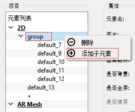
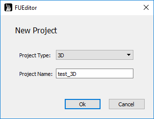
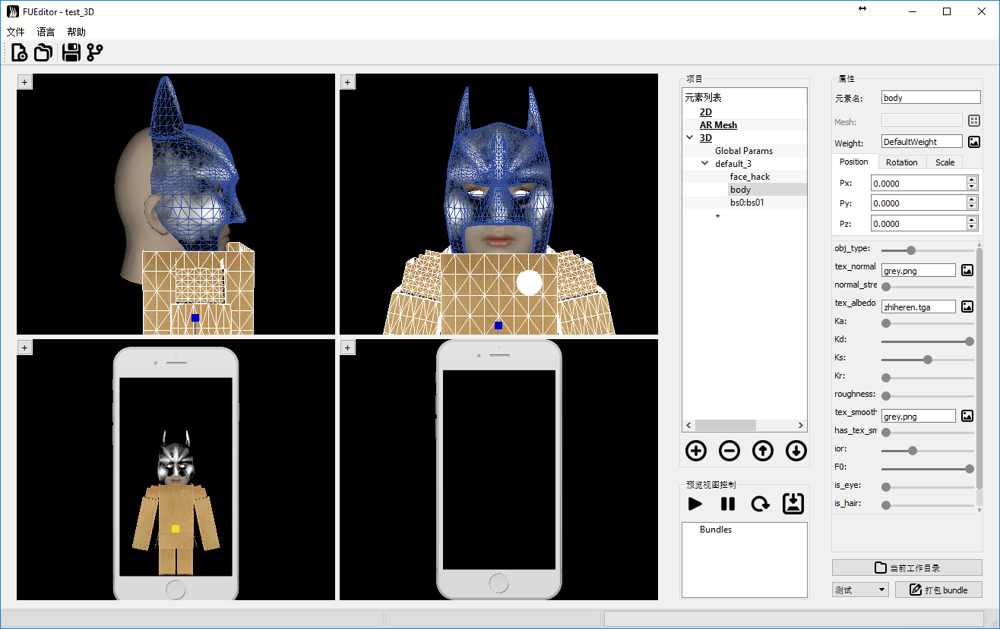
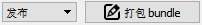

[TOC]
# **FUEditor 使用文档**

## 简介  
__FUEditor__ 是一款高效便捷的AR人脸道具编辑工具软件，为[Faceunity](www.faceunity.com)公司的Nama SDK提供支持。  
 - 可以高效制作2D道具。贴纸，贴纸动画，动画组，特定脸部动作触发动画。Faceunity的2D贴纸技术本质也是3D的，有前后景深效果，侧脸时仍能紧贴人脸，而不是全部贴纸都在一个平面上。  
 - 可以制作AR Mesh面具。  
 - 可以制作3D的道具，调整材质，如花环头盔等。  
    

## 1. 快速安装
- 系统要求  
  - win7/8/10 64位电脑
  - 摄像头，推荐使用 Logitech C920
    -FUEditor无须安装可直接使用，将FUEditor.zip解压到系统适当位置。
    -目录结构解释  
```C
+FUEdittor\          //FUEditor根目录
       -FUEditor.bat      //双击点击，启动FUEditor
       +bins\             //FUEditor程序库
       +data\             //FUEditor数据目录
       +log\              //FUEditor运行日志
       +Projects\         //所有道具项目的目录
         +daoju1\          //道具“daoju1”项目目录
           -daoju1.fuproj   //道具项目“daoju1”工程文件
           +build\          //已签名道具bundle（测试证书）
           +release\        //已签名道具bundle（正式证书）
           +zip\            //未签名压缩包
           +fcopy\          //自定义内容目录，用于自定义脚本
           +out\            //临时文件
         +daoju2           //道具“daoju2”项目目录
           -daoju2.fuproj   //道具项目“daoju2”工程文件
           ...
         +daoju3           //道具“daoju3”项目目录
           ...
```
- 启动程序  
   双击 FUEditor 目录中 FUEditor.bat 启动程序。显示最近项目列表，可以选择以前的项目，也可以新建项目。

    


- 查看example    
   FUEditor中自带一些示例项目，首次启动时，显示的项目即是示例项目，在最近项目列表中鼠标左键选择打开‘example_2D’项目。  

     

   ​

 进入示例项目，点击按钮启动摄像头，点击开始预览。  

## 2. 使用  
#### 2.1 新建项目  
- 创建：点击菜单__File__>>__New Project__，或者快捷键__Ctrl+N__，或者点击左上边按钮。弹出对话框，选择创建项目类型，输入项目名称

     

 创建完新项目后，界面左上角会显示__FUEditor – 项目名__，项目存放在 _FUEditor/Projects/项目名/_ 目录下。  
__注意__：所有道具项目存放在 _FUEditor/Projects_ 目录下，新建项目时不要重名。道具名称命名最好以“公司名缩写\_设计师名缩写\_道具名”规范来命名，如“fu\_crt\_maolian”。道具名最好不要和之前的一样，否则会覆盖掉之前打包好的道具。  
_FUEditor/Projects_ 目录下由程序创建的目录不要随意动。

#### 2.2 2D道具编辑
- 添加：点击2D类型下"__+__"号创建新的元素；或者在"__2D__"上右键选择"__添加子元素__"；或者选中"__2D__"，点击下面按钮添加新元素。  
- 删除：点击删除当前选中的元素。或者在元素上点右键，选择"__删除__"。    


- 2D元素属性：  
   修改查看元素的属性，在视窗中选择道具元素，或者再树状元素列表中选择元素，右边会显示对应的元素属性视图    


- 基本属性释意：
  - 元素名：当前元素的名称，可修改，不同元素元素名不同。
  - 图片：点击右边图片按钮，选择图片纹理，图片文件名不能是中文。  
    __注意__：2D元素帧动画序列命名必须是“xxxx_五位数字.扩展名” 例如， xxxx_00000.png, xxxx_00001.png 帧序列，  
    即使没有帧动画，只有一帧也需命名为xxxx_00000.png。图片最大不能超过2000×2000。图片太大，会影响性能,建议控制在1000×1000以下。  
  - 水平翻转：沿元素中心做水平翻转。
  - 垂直翻转：沿元素中心做垂直翻转。  
  - Nama5.6：sdk5.6版本及以上勾选此项以使用新版的背景分割道具，不勾选则使用旧版背景分割。  
  - __元素类型__:  
    - 跟随人脸元素: 跟随人脸的元素，将跟踪人脸移动或旋转。
    - 屏幕元素：屏幕元素，不会跟人脸动，不拉伸，直接绘制在屏幕。不同屏幕分辨率按照(rx,ry)在屏幕上绘制元素，(rx,ry)表示元素中心在屏幕上的比例，左上角为(0,0),右下角为(1,1)。  
    - 背景分割元素：背景分割元素，选择该模式的元素可以在相机画面中自动分割出人像，并替换背景为该元素内容。2D元素打开 **Nama 5.6** 选项可以使用新版的背景分割道具。  
      __注意__：2D道具的group不能作为背景分割元素，只能用单个道具做背景分割。  
    - 全屏前景元素：全屏前景元素，不会跟人脸动，高宽拉伸绘制在全屏幕。  
    - 全屏背景元素：全屏背景元素，不会跟人脸动，高宽拉伸绘制在全屏幕。
  - __旋转类型__:  
    - 旋转平移: 跟随人脸的元素，将跟踪人脸移动和旋转。
    - 仅平移：跟随人脸的元素，跟随人脸平移运动，但不旋转。  
  - 是否横屏：当元素是全屏元素时，才能选择该选项，且为横屏模式，不会跟人脸动，拉伸绘制在全屏幕。参见[横屏支持]章节。
  - xyz：元素的位置，可直接输入；也可以在窗口中拖动，鼠标放到坐标轴上，按住鼠标左键拖动即可。
  - 保持图片宽高比：勾选，让元素保持原来图片的宽高比约束，调整宽或高会自动调整另一个值。取消后可自由调整宽高。
  - 宽度：元素宽度。
  - 高度：元素高度。  
  - 开启深度测试：当2D元素和3D元素混合使用时，给2D元素开启深度测试，能获得正确的遮挡效果。  

    

- 动画参数释意：
  - FPS：播放帧速率，每秒播放多少帧。
  - 触发开始：当前道具从什么时候开始绘制。
  - 触发开始动作：当前道具在什么人脸表情动作下触发时开始绘制。
  - 是否需要保持动作：勾选时，且触发开始为“特定人脸表情动作”时，需要人脸保持某一动作，才能持续绘制道具元素。
  - 循环类型：当前道具的循环播放类型。
  - 触发结束：但特定条件满足时，结束当前道具元素绘制。
  - 触发结束动作：当前道具在什么人脸表情动作下触发时停止绘制。  
  - __结束后触发__: 结束触发表示当前元素结束时，激活触发其他已经结束的元素，点击右边按钮进行操作，可以用来做动画循环。例如 元素A，A的触发开始是[人脸出现]，触发结束是[特定动作X];元素B，B的触发开始是[特定动作X]且需要保持动作，__结束后触发__[A];那这动画是正常情况下播放A动画，当出现特定动作X时，A暂时关闭，播放B动画，B结束时，重新激活触发A，回到正常状态。  
  - __是否由其他元素触发__: (配合上面结束后触发)当元素设置为被触发时，即使这个元素是始终绘制(屏幕初始化)的也得等，其他元素结束触发它。用于做动画序列的。  
  - __是否仅活跃一次__：如果设置为是，那么满足触发条件，触发道具播放，当满足结束条件(特定动作、循环N次)该道具元素结束播放，结束后将不再重新触发。如果没设置为是，那么触发结束后，人脸离开屏幕再回来又能触发该元素播放。  

 __注 1__：具体动画逻辑参见2.3 __2D动画逻辑__ 章节  
 __注 2__：当出现，全屏元素没有覆盖满全屏时，需要设置isAndroid参数，Android/iOS客户端程序里也需要fuItemSetParamd做相应的设置，否则放到手机里预览不是预期的效果  

 ```C
 fuItemSetParamd(item_id, "isAndroid",1);     //第一个参数为bundleid，。
 ```
 __注 3__：背景元素以及全屏元素，在集成的Nama SDK版本大于4.0.0时，全屏元素会自动跟随人脸的旋转而旋转，如果需要在道具加载时就固定了方向，要调整方向，需要在代码中调整旋转角度，调用
 ```C
 /*
 / 第一个参数为bundleid，最后参数为旋转度数 0，90，180，270。
 / 每加90度相当于逆时针旋转90度。
 */
 fuItemSetParamd(item_id, "rotationAngle",90);
 eg.
 fuItemSetParamd(item_id, "rotationAngle",90);//Android 前置
 fuItemSetParamd(item_id, "rotationAngle",270);//Android 后置
 fuItemSetParamd(item_id, "rotationAngle",0);//非Android 平台
 ```
 __注 4__：判断道具是否结束，需要客户端主动查询道具的状态：
 ```C
 var ret1 = fuItemGetParamd(1,"hasFinish");//是否有（仅活跃一次）的元素已经结束了
 var ret2 = fuItemGetParamd(1, "allFinish");//是否 全部的（仅活跃一次）的元素已经结束了
 console.log(ret1, ret2);
 ```

- __横屏支持__：  
   2D属性"__是否横屏__"选择，只适用于全屏元素，勾选后。
    在预览区，点击鼠标右键，在弹出框中选择横屏预览。  
   __注__：一旦预览框选择对应的预览模式后，跟预览框模式不一样的全屏元素将不显示，仅仅是不显示，切换模式后将重新显示，打包正常。   

 __注__：程序使用时，在加载道具后，默认竖屏模式，但需要切换横屏时，需要调用代码,
```C
fuItemSetParamd(item_id, "isLandscape",1);     //第一个参数为bundleid，最后参数 0-竖屏 ，1-横屏。
```
上述 __isLandscape__ 参数只是切换纹理图，如果旋转方向不对，需要再调用下面代码，设置rotationTexAngle，该参数仅旋转纹理图片：  
```C
fuItemSetParamd(item_id, "rotationTexAngle",90);     //逆时针旋转90度
fuItemSetParamd(item_id, "rotationTexAngle",180);     //逆时针旋转90度
fuItemSetParamd(item_id, "rotationTexAngle",270);     //逆时针旋转90度
fuItemSetParamd(item_id, "rotationTexAngle",360);     //逆时针旋转90度
fuItemSetParamd(item_id, "rotationTexAngle",-90);     //顺时针旋转90度
```

#### 2.3 2D动画逻辑
单个元素，表示道具包中可编辑的最小单元。以下按照"__触发开始__"不同类型分类，描述各种不同条件下的动画逻辑。
- __触发开始__ - __人脸出现__：在出现人脸的时候，开始绘制元素，适用于需要人脸的元素。【当 "触发结束" 或者 "循环类型" 触发了结束后，暂时结束道具绘制，不管是否有人脸，当再次出现人脸时（有->无->有），再次绘制道具】。
 - 触发结束 - 默认：正常按照循环类型进行绘制。   
    - 循环类型 - 无限循环：则一直绘制该元素直到人脸消失，人脸出现时又重新绘制。
    - 循环类型 - 循环N次：循环绘制该元素N次(循环N次)，N 次后停止 该绘制该元素，暂停该道具。
    - 循环类型 - 循环1次并停留：播放道具一个循环后，停在最后一帧。
 - 触发结束 - 人脸出现：【未定义操作】
 - 触发结束 - 屏幕初始化：【未定义操作】
 - 触发结束 - 特定脸部动作：按循环类型进行绘制，如触发特定脸部动作,停止当前元素，暂停该道具。
    - 循环类型 - 无限循环：则一直绘制该元素直到人脸消失。
    - 循环类型 - 循环N次：循环绘制该元素N次(循环N次)，N次后停止该绘制该元素，暂停该道具。
    - 循环类型 - 循环1次并停留：播放该元素一个循环后，停在最后一帧。


- __触发开始__ - __屏幕初始化__：道具加载后，立即绘制，无须人脸出现，适用于一些全屏或背景元素。【当 "触发结束" 或者 "循环类型" 触发了结束后，暂时结束道具绘制，不管是否有人脸。再次从有人脸到无人脸时（有/无->有-> 无），再次绘制道具】
  - 触发结束 - 默认：无特殊触发条件，按照循环类型逻辑。
    - 循环类型 - 无限循环：一直绘制该元素，无论人脸有无。
    - 循环类型 - 循环N次： 循环绘制该元素N次(循环N次)，N次后停止该绘制该元素，暂停绘制，等待下次有脸到无脸的切换。
    - 循环类型 - 循环1次并停留：播放道具一个循环后，停在最后一帧。
  - 触发结束 - 人脸出现：当人脸出现时，暂停绘制，等待下次有脸到无 脸的切换。当没有人脸出现时，按照循环类型控制逻辑。
  - 触发结束 - 屏幕初始化【未定义操作】
  - 触发结束 - 特定脸部动作：当出现特定人脸动作时，暂停绘制，等待下次 有脸到无脸的切换。当没有人脸出现时，按照循环类型控制逻辑。


- __触发开始__ - __特定脸部动作__：道具加载后，需等特定人脸动作FaceActtionStart出现才触发元素绘制。适用于一些与人脸表情动作相关的元素。
  - __是否需要保持动作__ 选项：优先判断条件，当勾选时，人脸需要一直做着"触发开始动作"动作，才能保持元素绘制；不勾选时只要做一次"触发开始动作"触发，便开始绘制元素，开始绘制后，逻辑按循环类型以及触发结束来。
  - 触发结束 - 默认：无特殊触发条件，按__是否需要保持__特定脸部动作优先条件判断是否绘制。如绘制按照循环类型逻辑。
    - 循环类型 - 无限循环：一直绘制该元素。
    - 循环类型 - 循环N次：循环绘制该元素N次(循环N次)，N次后停止该绘制该元素。当脸部动作"触发开始动作"再次被触发时，能够再次绘制。
    - 循环类型 - 循环1次并停留：播放道具一个循环后，停在最后一帧。
  - 触发结束 - 人脸出现【未定义操作】
  - 触发结束 - 屏幕初始化【未定义操作】
  - 触发结束 - 特定脸部动作，当出现特定人脸动作特定脸部动作End时，停止绘制元素，当脸部动作FaceActtionStart再次被触发时，再次绘制。当没有特定人脸特定脸部动作End出现时，按needtokeep特定脸部动作优先条件判断是否绘制，如果绘制按照循环类型控制逻辑。  

---
#### 2.4 特定脸部动作
当道具元素选择触发开始类型为："特定脸部动作"，然后在触发开始动作列表中选择一个动作，能够根据人脸的特定表情触发元素播放。  

  

###### 2.4.1 内置特定动作
- "taimei" 是判断用户 抬眉毛的动作  
- "taizuijiao_zuo"是判断用户 抬左边嘴角的动作  
- "taizuijiao_you"是判断用户 抬右边嘴角的动作  
- "nu"是判断用户 怒的动作  
- "zuixing_o" 为嘴型O形  
- "zuixing_a" 为嘴型A形   
- "zuixing_du" 为嘴型嘟嘴形状  
- "zuixing_min" 为嘴型抿嘴形状  
- "zuixing_guqi" 为嘴型鼓气形状   
- "biyan_zuo" 为闭左眼  
- "biyan_you" 为闭右眼   
- "zhuantou_zuo" 为头往左边转   
- "zhuantou_you" 为头往右边转  
- “weixiao” 为微笑表情  
- “haqian” 为打哈欠表情  


###### 2.4.2 自定义脸部动作
其中 "触发开始动作" 用户可以自定义。定义动作的文件为FUEditor/data/tools/actions.json。文件内容如下，是一个json文件，actions是一个数组，定义了上面图中所示的动作列表，每一个动作有name属性，name最终会显示在界面上。condition属性为具体判断条件，这里的condition是js脚本的条件语句。params.expression数长度为46，对应的46个表情通道，具体对应《Blendshape制作教程》。
例如
```
{
    "actions": [
        {
            "name": "taimei",
            "condition": "params.expression[16] >= 0.4 || params.expression[17] >= 0.4 || params.expression[18] >= 0.4"
        },
        {
            "name": "taizuijiao_zuo",
            "condition": "params.expression[24] >= 0.4 || params.expression[28] >= 0.4"
        },
        ………..
    ]
}
```

---
#### 2.5 手势动作

当道具元素选择触发开始类型为："手势动作"，然后在手势列表中选择一个手势，能够根据特定手势触发元素播放。  

  

内置10种手势：  

- thumb是翘起大拇指  
- six是6的手势  
- cute是用手靠近脸侧横向握拳  
- push是手掌往外推  
- hold是手掌往上  
- korheart是食指和大拇指交叉  
- photo是拍照动作，即双手做出方框动作  
- greet是双手抱拳  
- rock是摇滚动作，即单手呈飞机状食指向上  
- cross是双手交叉   

手势跟随：  

在元素类型选择“跟随手势”即可在手势元素触发时跟随  

  

每个bundle只能支持一种手势，多手势可以添加不同的bundle，但是会导致识别效率下降的问题。  

- - -

#### 2.6 组动画

###### 2.6.1 添加组动画
创建组：  
   
 创建子元素：  
   
###### 2.6.2 元素组构成
元素组由组的根节点以及组内元素构成：

- 组的根节点，控制该组动画逻辑，组的动画逻辑如上定义单个元素的控制逻辑。
- 组内元素，只能设置在当前组内循环次数N，循环结束后，开始组内下一节点的动画。
- 组内最后一个元素，可以设置在当前组内循环次数N，循环结束后重新进入根节点逻辑；也可以设置为"无限循环"，这样前面的元素播放完后，开始无限循环最后一个，例入一群蝴蝶往头上飞，到头上后停在头上煽动翅膀，飞动画播放一次，停下来煽动无限循环。

###### 2.6.3 调整组元素顺序
组动画的播放顺序由在元素列表先后顺序决定，点击右键可以调整元素前后关系  

   


#### 2.7 截图  

点击菜单栏的 按钮截屏，图片文件将会保存在res目录下。  

- - -

## 3. AR Mesh 制作
#### 3.1 普通AR Mesh贴图制作  
AR Mesh 是拟合人脸的一个3D的mesh, 当需要制作"面具"，可以使用该功能。

- 创建：点击列表中"AR Mesh"下"+"创建新的元素。
- 删除：右键点击"删除"删除当前选中的元素。
- 调整：可以通过右键调整元素的先后顺序。
- 变形：AR mesh可以选择是否参与瘦脸等美颜效果的变形，勾选变形AR mesh表示参与变形。  
  __注__：支持多层 AR mesh，前后关系由在序列中先后顺序决定。  

AR Mesh 纹理制作方法：
- 方法一：可以使用 FUEditor/data/ref/ar_demo3.obj 在 3d max/maya 等工具中进行 UV 映射，制作贴图。
- 方法二：参考 FUEditor/data/ref/ default_ar.png 或 reference_head.png，根据 UV 图 FUEditor/data/ref/ ar-uv.png （半透明可叠加）在 PS 等工具中制作贴图。  

#### 3.2 高级换脸功能   
换脸使用方法：  


- 选择图片：点击“换脸”行的图片选择按钮，图片文件名不能是中文，选择一张人脸图片，操作类似下图所示：    


- 高级融合：勾选高级融合选项开启高级融合人脸功能。（仅换脸能够使用该功能）  

- 高精度网格：勾选高精度网格选项生成一张高分辨率人脸。（勾选高分辨率需要开启高级融合，否则会导致贴图错误）。  

  __注意:__ 开启 __高精度网格__ 功能时，Android/iOS/PC客户端需要加载__ardata_ex.bundle__  ，否则会崩溃。
  ```C++
  //c++
  vector<char> bundlebyte;
  string bundlepath = mdh.m_data_path + "/ref/ardata_ex.bundle";
  if (false == loadbinary(bundlepath, bundlebyte)){
  	loge("load bundle failed:%s\n", bundlepath.c_str());
  }
  else {
  	//load ardata_ex.bundle
  	fuLoadExtendedARData(bundlebyte.data(), bundlebyte.size());
  }
  bundlebyte.clear();
  ```


## 4. 静态3D道具制作
Faceunity Nama SDK拥有实时跟踪三维人脸的能力，能够实时推算人脸在相机空间中的坐标以及人头的三维模型。所以可以根据[参考人头](#8- )制作3D道具。obj原模型放在"_FUEditor/data/ref/ar_demo3_",制作3D模型时可以参考该模型大小进行制作。首先要制作模型准备素材，再使用FUEditor进行预览打包，以及调整材质。
#### 4.1 道具制作
- 模型制作  
  根据参考人头obj，在3D Max/Maya等三维建模软件中制作想要的道具,最后导出obj文件。下面以maya为例，
  1. 一定要导出材质和组  
      材质在导出之后肯定是要重新调整过的，但是编辑器仍然需要知道 Maya 里哪些面 绑的材质是一样的，哪些面是不一样的。要不然到编辑器里所有的面就会合到一起， 不能分开调了。组也是一样的道理。  
      __注__：一个组内只能使用一个材质。      
          

  2. 一定要对着参考人头调好模型大小，对于道具更要调整好位置  
      导入参考人头到maya中  
        
      编辑器有一定的位置和大小调整功能，但如果道具小了/大了几十倍上百倍肯定就不行了。  
        

- 创建3D项目  
  1. 点击创建项目，项目类型选择3D，输入项目名称，点击"OK"创建项目。  
       

  2. 创建新的3D元素：在项目"__元素列表__"中点击"__3D__"类别下"__+__"，创建新的3D元素。  
  3. 加载obj：在"__属性列表__"中，网格项中点击右边按钮，在弹出对话框中选择需要加载的obj。  
             

   __注__：在导出的obj的材质mtl，最好也导出贴图信息，并确保路径正确。  

   加载fbx：在"__属性列表__"中，网格项中点击右边按钮，在弹出对话框中选择需要加载的fbx文件。
   

#### 4.2 材质调整
FUEditor默认采用"__GGX__"光照模型。  
在预览视图中选择要调整的部件或者在项目列表选择部件。选中右边会显示该部件的属性信息。  
在项目列表中选择"__Global Params__",右边会显示全局参数属性信息。    

**颜色选择器**：目前的Editor支持颜色选择功能，点击选择图标将会弹出颜色选择对话框，选择想要的颜色即可；  

在脚本中添加如下代码即可支持  

//@gparam L0 {"type": "color","default_r": 1,"default_g": 1,"default_b": 1}  

//@mparam L0 {"type": "color","default_r": 1,"default_g": 1,"default_b": 1}  

gparam是为全局参数，mparam是为3d item参数，default_r、default_g、default_b是为默认颜色值取值范围为0到1。  

- 全局参数  
  - "tex_light_probe":环境图  
  - "envmap_shift"：环境图的旋转角度  
  - "envmap_fov": 环境图的视角
  - "log_scale"：道具整体缩放的比例，用对数调节是为了方便  
  - "eyeRscale"：眼球左右旋转的倍率
  - "L0_yaw"：主光的航向角，也就是左右转的那个角  
  - "L0_pitch" 主光的俯仰角，也就是上下转的那个角  
  - "L0_R"：主光的颜色，R通道  
  - "L0_G"：主光的颜色，G通道  
  - "L0_B"：主光的颜色，B通道  
  - "L0Intensity": 主光的强度，用对数调还是为了方便
  - "L1_yaw"：补光的航向角，也就是左右转的那个角
  - "L1_pitch"：补光的俯仰角，也就是上下转的那个角
  - "L1_R"：补光的颜色，R通道  
  - "L1_G"：补光的颜色，G通道  
  - "L1_B"：补光的颜色，B通道  
  - "TexFPS"：贴图动画的帧率，需要子部件的 tex_albedo 选择成动画帧 xxx_00000.png, xxx_00001.png ...    
  - "L1Intensity": 主光的强度，用对数调还是为了方便
  - "alphaThreshold"：半透明算法阈值，设为1.0适合普通简单的半透明物体，设为0.5适合头发。  
  - "is_fix_x": 在有人脸的情况下，是否固定位置,不跟随人脸运动，固定位置如下fixed_x。  
  - "is_fix_y": 在有人脸的情况下，是否固定位置,不跟随人脸运动，固定位置如下fixed_y。  
  - "is_fix_z": 在有人脸的情况下，是否固定位置,不跟随人脸运动，固定位置如下fixed_xz。  
  - "fixed_x":在有人脸的时候的固定位置 ,x.   
  - "fixed_y":在有人脸的时候的固定位置 ,y.   
  - "fixed_z":在有人脸的时候的固定位置 ,z,z 向里，越大越远.   
  - "isnofacerender":在没有人脸的时候是否绘制, 如果绘制那么以下面的点为固定点。  
  - "fixed_nx":在没有人脸的时候的固定位置 ,x.   
  - "fixed_ny":在没有人脸的时候的固定位置 ,y.   
  - "fixed_nz":在没有人脸的时候的固定位置 ,z,z 向里，越大越远.   
  - "use_fov":是否使用自定义的FOV，注意AR模式下不能使用这个参数，AR模式下调整fov需要通过客户端调用fuFocallengthscalse接口调整fov大小。    
  - "camera_fov":投影fov大小，需要先开启“use_fov”。  
  - "rot_weight":控制旋转的幅度，rot_weight=控制旋转的幅度，rot_weight=0不跟人头旋转。 
  - "expr_clamp":默认不打开，当客户端的SDK的表情系数范围会小于0，大于1时，而且会出现模型表情过于夸张，或者模型穿刺时，希望把表情系数裁剪到（0,1）范围时，打开此开关。 
- 部件材质参数：
  - "obj_type":物体的类型
    - 一是镂空[0,0.25]
    - 二是会完全随着脑袋旋转和缩放,(0.25,0.5]
    - 三是权重控制旋转的幅度（前提是有对应主obj的weight.png,例如aa.obj对应的权重贴图是aa_weight.png）,(0.5,0.75]
    - 四是只会跟着脑袋位移变化和大小的缩放，例如身体(0.75,1]。  
  - "tex_normal": 法向贴图，就是蓝了吧唧的那种，不是bump map哦～bump map要先转一下哦～～ 默认的grey.png等于没有贴图  
  - "normal_strength"：法向贴图的强度，为了照顾没有法向贴图的模型，强度默认是0，所以设了法向贴图之后要把强度拽高点才能看到效果  
  - "tex_albedo"：颜色贴图，会自动加载obj对应材质库mtl中Ka_map，如没有Ka_map,默认的white.png是白的，需要选择部件对应的贴图。如要做出3D贴纸动画，这里tex_albedo选择成动画帧序列的某一帧即可 xxx_00000.png, xxx_00001.png ...，命名规范和2D动画帧一致，必须是xxx_00000开始，系统会自动加载所有帧并完成帧动画逻辑。
  - "Ka": 自发光强度
  - "Kd"：漫反射强度
  - "Ks"：高光强度，注意高光不受颜色贴图影响
  - "Kr"：环境图反射强度
  - "roughness"：表面粗糙度。越大高光越分散，越小高光越集中
  - "tex_smoothness"：高光强度贴图。在alpha通道里放的是影响高光和反射的权重，越大表示越亮。可以和颜色贴图放在一起哦。
  - "has_tex_smoothness"：高光强度贴图的整体强度（有些拗口……），为了照顾到大多数没有高光强度贴图的模型，默认是0。设了贴图之后要把强度拽高哦～
  - "ior"：环境图反射的折射率。折射率越小，反射从正面到边光的亮度变化越明显，整体强度越小。
  - "F0"：高光的金属度。越高越接近金属，越低越接近塑料。
  - "is_eye"：是眼睛就拽到右边，不是就拽到左边。是眼睛则会随眼球转动  
  - "is_hair"：是头发胡子就拽到右边，不是就拽到左边。是头发则会加入透明处理  

__注__：调整材质参数可以分为两种情况：
- 1 当实时预览未开启时，这时调整参数是看不到直接的结果
- 2 在加载完模型，并调整好位置了之后，可以"打包bundle",并开启实时预览窗口，这个时候，再进行参数调整时，将能够实时的看到调整的结果，最终调整完时，需要重新"打包bundle",确保调节好的参数能够打包到bundle里面。  

##### 4.2.1 材质复制粘贴  
部件材质参数支持拷贝粘贴，具体做法是在具体部件的材质列别上点击右键，选择“复制全部参数”，然后到另一个部件上，选择“粘贴全部参数”，实现全部全部材质信息的拷贝。需要注意的是：复制和粘贴的过程，tex_albedo等贴图材质信息也会复制，如果不是使用相同的贴图，那么复制粘贴后，需要重新设置贴图信息。  

#### 4.3 贴图动画  
FUEditor 3D道具支持循环贴图动画，类似于2D贴纸动画，可以创建一些贴合脸部的3D模型，并使用贴纸动画，使得贴纸动画更具立体感。  
在预览视图中选择要调整的部件或者在项目列表选择部件。选中右边会显示该部件的属性信息。  
在项目列表中选择"__Global Params__",右边会显示全局参数属性信息。    
- 全局参数  
  - "TexFPS"：贴图动画的帧率  
- 部件材质参数：
  - "tex_albedo"：颜色贴图，会自动加载obj对应材质库mtl中Ka_map，如没有Ka_map,默认的white.png是白的，需要选择部件对应的贴图。如要做出3D贴纸动画，这里tex_albedo选择成动画帧序列的某一帧即可 xxx_00000.png, xxx_00001.png ...，命名规范和2D动画帧一致，必须是xxx_00000开始，系统会自动加载所有帧并完成帧动画逻辑，而3D贴纸帧序列可以UV展开绘制。  

#### 4.4 3D道具水平翻转  
当需要对3D道具进行水平翻转时，需要在客户端调用如下代码：  
```C  
fuItemSetParamd(1,'is3DFlipH',1);	//翻转模型顶点
fuItemSetParamd(1,'isFlipExpr',1);	//翻转表情系数
fuItemSetParamd(1,'isFlipTrack',1);	//翻转跟踪位移旋转
fuItemSetParamd(1,'isFlipLight',1);	//翻转灯光
```

#### 4.5 舌头  

在animoji模板下可以使用舌头跟踪功能。找到Global Params下的tongue选项，将其设置为1即可开启舌头跟踪。舌头需要制作56个blendshape，即后10个为对应表情的舌头动作。  

## 5. 动画制作  

 FUEditor支持FBX格式骨骼动画，基本流程：首先添加‘3D’网格模型，网格模型载入支持.obj .fbx格式，再添加FBX骨骼动画并绑定到对应的‘3D’网格模型上，设置好骨骼动画元素的触发动画逻辑即可。
- 添加FBX动画  
  在项目元素列表中点击"__Anim__"下的"__+__"添加一个骨骼动画元素，在右侧"__属性列表__"中，骨骼项中点击右边按钮，在弹出对话框中选择需要加载的fbx文件加载fbx动画。  
     

- 绑定骨骼动画  

当加载了fbx动画以后，需要将动画绑定到对应的网格模型（3D项），操作如图：  
     

__注1__：如需绑定动画则必须对应到正确的网格模型，拓扑一致，否则会导致无法打包。例如：3D元素使用了obj格式导入，那么绑定的动画需要有相同的拓扑结构（即使用相同的obj在maya/max中绑定骨骼系统）。  
__注2__：骨骼不能有缩放变换，并且影响每个顶点的骨骼数不能超过8根，否则会导致动画错乱。  
__注3__：骨骼动画元素的‘触发动画逻辑’和3D道具相同。  

## 6. Avatar制作
Avatar指的是3D模型，且脸部有跟Nama SDK一致的[Blendshape/Morpher](#8- )，能够被Nama SDK驱动，进行脸部动画跟踪的模型。
- 与静态3D道具相异之处：需要一组blendshape obj。  
- obj的命名规范，每个表情对应一个obj（命名为__bsx.obj__，x为序列号），可以只做其中的一部分，如下图所示：  
     

 其中 bs0.obj 是自然表情。拓扑结构需要保证这些obj的顶点顺序、面顺序、人头位置都是一样的。"_FUEditor/data/doc/blendshape_\__guide_" 目录下脚本 exportObj.mel 可以帮助把maya的blendshape导出成obj文件。如果使用这个script，需要保证每个blendshape表情的名字规范为\*bs0.obj、\*bs1.obj、\*bs2.obj、\*bs3.obj、…、\*bs46.obj。  
- 导入avatar模型的步骤：启动FUEditor.exe，创建3D项目，点击加载模型网格，选择 __bs0.obj__ 导入，剩下的obj工具会自动加载进去。__注意__：必须选择 __bs0.obj__。   
- 制作blendshape时需要注意：自然表情保持全部肌肉放松，不要有笑容等表情变化；其他表情需要在自然表情的基础上修改，只修改需要的部分即可，例如制作闭左眼的表情，右眼等其他部分要与自然表情完全相同。  
- 自然表情和46种表情，参见"_FUEditor/data/doc/blendshape_\__guide_"目录下的 __Blendshape_Guide.pdf__。

## 7. 人像驱动

#### 7.1 简介  

Picasso让照片活起来的技术。用户选择一张照片，经过自动的人脸重建，头发分割后，新的“照片”就能够实时驱动起来，也可以播放预制好的表情动画，制作成表情包。

#### 7.2 效果  
以下是最终的效果示例，从左到右分别是原图，动作1，动作2。  


#### 7.3 使用方法
- 加载picasso.bundle
- 需要带有picasso的权限的证书  

#### 7.4 人像驱动道具制作
在创建项目时，项目类型选择“Picasso”，输入项目名，创建工程。再选择图片，等待生成内容。需要联网，大概需要等待几秒，内容生成完后，进行打包预览即可。目前只支持图片内容为单个人脸，不支持多人脸生成。
  

## 8. 高级视频滤镜  
高级视频滤镜功能，需要在启动FUEditor时，选择相关Filter类型项目，或者创建Filter类型的项目。  
__注__: 进入2D/3D道具编辑功能后无法切换到Filter项目，需要重新打开FUEditor。

## 9. 打包道具
道具编辑修改完成后，需要进行打包操作。  
2D项目支持2D元素和AR Mesh混合打包。  
打包会自动保存项目。  

__测试打包、正式打包__：
- 签名的证书分为两种，测试证书，以及正式证书，测试证书签出来的bundle，有一定时效性，运行一段时间后会消失。而正式证书签名的bundle可以一直运行。  
- FUEditor内置了测试证书，通过  打包出来的bundle即是测试bundle。测试bundle：点击"打包bundle"按钮，等待打包，道具打包后在"FUEditor/Projects/当前道具/__build__/"目录中。  
- 测试打包又可以分为两个过程，一是"__测试-生成__",生成过程即是将图片等资源进行转换；一是"__测试-签名__"，将转换好的资源进行加密打包。当需要修改一些临时脚本时，可以只"__测试-生成__"一次，多次修改生成的内容并多次"__测试-签名__"，这样可以节省生成时的耗时。  
- 通过  打包出来的bundle即是正式发布bundle，道具打包后在“FUEditor/Projects/当前道具/__release__/”目录中。  
   __注：__ 1.正式发布前需要确保测试打包正常。2.正式发布需要__网络连接__，需要正式证书。3.签名优化可以修改菜单栏里的为优化模式(此设置要求Nama版本最低5.9.0) 后打开优化版签名模式。
- 点击 直接打开当前项目目录。
- 支持显示道具的签名类型，黑色为正在开发的bundle。红色为测试打包，蓝色为正式打包。如需查看可点击按钮添加到这个列表后来查看bundle道具签名类型。

## 10. 项目保存与切换
- 点击 ，保存当前项目xxxx，工程文件在Project/xxxx/xxxx.fuproj。保存后可以打开重新读取。
- 点击 ，在弹出的对话框中输入新项目名xxxx2，点击确认另存为。当前的项目会另存为到Project/xxxx2下，同时切换到新的项目上工作，左上角显示FUEditor-xxxx2。
- 点击在Projects目录中选择要打开的项目，最后选择xxx__.fuproj__文件打开，如下图

 

## 11. 高级功能自定义动画脚本
编辑完道具后，选择"测试"并点击"打包bundle"，FUEditor开始打包测试用的bundle，并且，会在"_out_"目录下生成待打包的资源，包括script.js。script.js是控制道具动画的逻辑。可以通过修改script.js能高度自定义道具动画。当需要进行脚本修改，或者添加其他资源文件时。可以在项目的"_fcopy_"中放置需要添加的文件，以后每次打包(测试/发布)时，FUEditor会主动将"_fcopy_"目录下的文件拷贝或者覆盖到"_out_"目录中，并最终打包到bundle内。  

## 12.自定义模板

在目录FUEditor\data\tools\templates保存有预设的模板可供使用，选择模板只对3d道具有效果，2d道具无论选择何种模板效果都是一样的，同样的模板也不会影响filter项目和picasso项目。    

在新建项目时选择对应的模板名即可使用相应的模板，不同的模板下模型可以调节的材质参数是不同的，用户可以自己制作模板放入该目录下即可在新建项目时使用，simple模板是最简单的模板采用phong光照模型，自定义模板可以参考simple模板进行制作，default模板则是默认模板，光照模型用的是默认的ggx。  

目前共有10个预设模板，以下为模板介绍：  

default模板是默认模板，采用默认的ggx光照，兼容以前版本的道具；  

simple模板是简易模板，采用Lambert光照，使用精简的输入项；  

cartoon模板是卡通风格模板，采用卡通渲染；  

shadow模板可以让模型产生阴影；  

blinn模板采用blinn光照模型；  

lambert模板使用lambert光照模型；  

phong模板使用phong光照模型；  

ward模板使用ward光照模型；  

animoji用于制作animoji道具；  

advance模板为ggx模型加入ao效果；  

使用模板：  

  

animoji模板的材质参数：    

ambient_light_intensity:  ambient光照强度  

L0_yaw: 主光源左右方向调节  

L0_Pitch:主光源上下方向调节，0.45表示从上方45度角照亮模型  

L0_R，L0_G，L0_B: 主光源颜色  

L0Intensity:主光源强度    

Tex_ao：    ao贴图  

Tex_albedo:  颜色贴图  

Tex_specular:高光贴图  

Tex_emission:自发光贴图  

Ao_intensity:  AO图作用强度  

Diffuse_intensity:diffuse图作用强度  

Diffuse_wrap:漫反射的过渡强度。下图分别为同等光照下，值为0.0和0.5的效果。Wrap值越大，背面越通透  

Diffuse_light_add:加强漫反射的光照  

Specular_intensity:高光的强度  

material_shiness_max:高光最光滑部分的shiness系数  

material_shiness_min:高光最粗糙部分的shiness系数  

Emission_intensity:自发光强度  

**animoji效果**  

  

**animoji+shadow 阴影效果**


可以在猫胡须下和后脑勺看到明显的阴影效果。

**animoji+物理动效**


斗牛犬的耳朵可以随着摇头而自由摆动。物理动效的制作详细查看FUEditor/data/doc/FUEditor Physics User Specification.html

打bundle前在GlobalParams里调整enable_physic至1.0，同时在fcoby文件夹里放入物理资源文件（bodies.json和joints.json）和骨骼数据（Anim里添加骨骼文件），即可开启物理效果。

**animoji+舌头**

导入带有舌头的模型，在GlobalParams里调整tongue至1.0，即可开启舌头跟踪。

**animoji+AR模式+多人脸**

animoji已支持多人脸，仅建议在AR模式下运行，打包制作流程和bundle调用和以前一样。

在GlobalParams里调整follow至1.0，即可开启AR模式。

代码进入AR模式的参数为（请注意双引号）：

{"thing":"\<global\>","param":"follow"}  

注意：follow模式会关闭背景  


## 13. 实时预览  
 - 打开摄像头，点击 按钮。
 - 暂停播放，点击 按钮。
 - 切换预览分辨率，在预览窗口单击右键，弹出菜单如图，可选项为相机输入分辨率的一倍（1X）、二倍（1X）、四倍（1X）、八倍（1X）的大小，倍数越大渲染分辨率越高，相应也要求更高品质的硬件设备。普通配置的PC建议最高在二倍分辨率使用。
 - 多摄像头切换，点击选择菜单“摄像头”，在“相机列表”中选择对应的摄像头。
 - 选择本地视频作为输入视频，点击选择菜单“摄像头”，点击“捕捉视频文件”，选择视频文件。
 - 关闭释放摄像头，选择菜单“摄像头”，点击“关闭相机”。  

## 14. 工具  
 - __表情夸张转换__：将旧avatar数据，转换为新avatar数据，保证在关闭表情系数限制后，avatar混合表情正确。点击菜单栏"_工具_"，点击"_表情夸张转换_"，选择旧bundle，在自动转换后，将使用测试证书自动打包，点击刷新按钮可以看到效果。确认无误，请自行发布打包。  
 - __同步服务器__：创建服务器，将release目录下的bundle作为默认下载数据。默认使用局域网ip地址进行服务器创建，端口默认使用13157。  

## 15. P2A道具制作  

FUEditor支持打包P2A道具  

新建P2A类型项目；有Male，Female，MaleArt，FemaleArt 4种模板可供选择，道具类型包括身体，头发，衣服眼镜，帽子，脸部妆容（胡子，眉毛等 以下声明为妆容），动画，相机， 8种  


选择道具类型，创建P2A道具项目，进如操作界面选择**对应**的模型FBX文件和贴图文件（选择和工程类型不一致的FBX会导致制作错误），不同类型的道具拥有不同的参数（全局参数也是不同的），一般选择各自的贴图并按照默认参数设置即可，打包和测试同普通道具，如果测试并没有加载对应的道具则需要生成发布版bundle，并手动添加bundle即可。  

A2P目录下的**bg.bundle**是为纯色背景的bundle，p2a需要添加背景加载这个bundle即可。  

**注意：**帽子制作需要在Global Params中设置hat_type，-1帽子适配没有头发，0适配头发blendshape0，1适配头发blendshape1...以此类推。  

妆容的参数在Global Params中选择，无需添加3d或者anim项，设置完Global Params参数打包即可。  

妆容部分包括脸部所有部分（眉毛，眼睫毛，胡子，腮红，眼影，纹身等），最多同时支持6层，所有部分制作方式相同，以胡子为例：为节省内存并提高胡子精度，胡子贴图只需要保留嘴唇附近有胡子部分，并保证贴图大小为2的幂次即可(128,256,512,1024,2048)。 

可以给动画加入blendshape，但是只能加一组，在打包anim类型的bundle时需要在动画项的Head Node栏指定需要导出blendshape的node名字，选择3d项目里面对应的子项名即可，例如：nvKThead_mesh  

##### 创建工程说明：

```Project Tpye```：工程类型，一律选择【P2A】。

```Project Name```：工程名称，命名建议使用英文或者数字

```Body_Type```

- Male：男性身体
- Female：女性身体

```Component```

- body：身体

- hair：头发

- clothes：衣服、配饰

- glass：眼镜

- hat：帽子

- facebeauty：妆容

- anim：动画  

- camera：相机


**常见问题**  

1.导入后元素名出现乱码的情况，需要修改元素名为英文，否正素材无法正常显示。  

2.贴图导入后报 load bone error ，是骨骼数量不对  

3.制作鞋子时通过鼠标缩放还是无法看到双脚部分，需要调整模型位置，在js里设置一下代码  

```
//第三个值为垂直世界坐标 
fuItemSetParamd(1,'translation_y',-0.5);
```

**打包道具**  

##### 1.头发制作示例  

注意：头发需要绑定动画，否则无法显示效果  


##### 2.衣服制作示例  


##### 3.配饰制作示例  

配置制作同衣服的方法一样  


##### 4.动画制作示例  


##### 5.制作鞋子示例  


##### 6.制作相机动画示例

注意：相机动画的时间和动画同步，没加载动画则相机不动。


**参数说明：**

 头发：    

 Tex_albedo	颜色贴图	

 Tex_normal	法线粗糙度贴图	

 Tex_spec	高光贴图	  

 TransFactor	半透明比值	默认1.0保持贴图效果，值越高，头发越实  

 S_shift	主高光偏移量	正数往发根偏移，负数往发梢偏移  

 S_shift2	次高光偏移量	  

 S_shift2Gloss	次高光聚合程度	值越大，高光越聚拢  

 Diffuse_Base	头发固有色暗部补偿	默认0.2，避免暗部出现死黑  

 AlphaThreshould	Alpha Test系数	默认0.6  

 身体：  

 tex_base_color	基础颜色图	

 tex_metallic_gloss_ao	合成图	R通道金属度 G通道粗糙度 B通道AO  

 tex_normal	法线贴图	  

 tex_curvature	曲率图	Substance/toolbag/knald均自带烘焙，用于表现皮肤的SSS效果  

 Diffuse_Base	固有色暗部补偿	可以增强暗部光照通透感  

 Metallic_factor	金属度强度	  

 Gloss_factor	光滑度强度	  

 Gloss_horizontal_factor	水平视角光滑度提升	  

 Fresnel_intensity	菲尼尔强度	  

 Occlusion_intensity	AO强度	  

 curvature_scale	曲率强度	曲率越强，SSS效果越重    

 衣服：  

 tex_base_color	基础颜色图	  

 tex_metallic_gloss_ao	合成图	R通道金属度 G通道粗糙度 B通道AO  

 tex_normal	法线贴图	  

 Diffuse_Base	固有色暗部补偿	可以增强暗部光照通透感  

 Metallic_factor	金属度强度	  

 Gloss_factor	光滑度强度	  

 Gloss_horizontal_factor	水平视角光滑度提升	  

 Fresnel_intensity	菲尼尔强度	  

 Occlusion_intensity	AO强度	  

 眼镜：  

 is_glasses	是否是镜片	镜片设置为1.0，才能正确呈现玻璃效果  

 tex_base_color	基础颜色	  

 tex_normal	法线贴图	  

 tex_refl	反射贴图	  

 refl_rotate	反射贴图旋转角度	  

 refl_f0	镜片的反射系数	  

 refl_intensity	镜片反射高光强度	  

 refl_uv_offset_x	反射uv横向偏移系数	  

 refl_uv_offset_y	反射uv纵向偏移系数	  

 refl_uv_offset_scale	反射uv缩放系数	  

 glass_opacity	镜片的不透光率	  

 Diffuse_Base	固有色暗部补偿	  

 Metallic_factor	金属度强度	  

 Gloss_factor	光滑度强度	  

 Gloss_horizontal_factor	水平视角光滑度提升	  

 Fresnel_intensity	菲尼尔强度	   

 Occlusion_intensity	AO强度	  

 帽子：  

 tex_base_color	基础颜色图	  

 tex_metallic_gloss_ao	合成图	R通道金属度 G通道粗糙度 B通道AO  

 tex_normal	法线贴图	  

 Diffuse_Base	固有色暗部补偿	可以增强暗部光照通透感  

 Metallic_factor	金属度强度	  

 Gloss_factor	光滑度强度	  

 Gloss_horizontal_factor	水平视角光滑度提升	  

 Fresnel_intensity	菲尼尔强度	  

 Occlusion_intensity	AO强度	  

 妆容：

 tex_color	颜色贴图  

 blend_weight  混合强度  

 is_blend_alpha 是否替换alpha  对于睫毛类需要alpha的，填1.0  

 is_eyebrow 是否是眉毛    1 表示是眉毛，0不是

 offset_x	贴图x起始位置  

 offset_y	贴图y起始位置  

 size_x	贴图大小x  

 size_y	贴图大小y  

 total_size	原贴图大小    


**P2A注意事项**：  

1. 一个工程下只能有一个3d元素和一个动画元素；  


2. anim类型道具必须新建动画元素导入动画；  


3. 在editor中不能够调节3D元素的大小、位置、旋转，显示效果由模型本身控制；  


4. 3d参数调节以后不能立即预览，需要先打包；  


5. 贴图和模型名字不要用中文；    


  

## 16. ETC压缩纹理支持

FUEditor默认贴图打包格式为webp。如需使用ETC压缩格式，在菜单栏选择设置->纹理压缩格式->etc/etc(高质量)。
建议使用etc而非etc(高质量)，使用后者会使压缩时间变得非常久。注意：高级换脸功能不会使用ETC格式。

## 17. 常用术语解释

- __道具项目__：表示用户创建的每一个道具工程，项目存放在 _FUEditor/Projects/项目名/_ 目录下。
- __元素__：元素表示由用户创建的每一个道具部件，如2D项目的一个矩形片，一张AR Mesh，一个3D部件。
- __bundle/item__：生成资源，经过zip压缩后，再进行签名加密得到的文件。后缀名为.bundle
- __测试证书签名、正式证书签名__:  
  - 签名的证书分为两种，测试证书，以及正式证书，测试证书签出来的bundle，有一定时效性，运行一段时间后会消失,测试包的使用时间一般为两分钟左右，之后会导致人脸识别失败并报“debug key used, 100 frames remaining，debug key or authentication failed, rendering stopped”之类的错误。。而正式证书签名的bundle可以一直运行。  
  - FUEditor内置了测试证书，通过打包出来的bundle即是测试bundle。
  - 通过打包出来的bundle即是正式发布bundle。当软件交付给客户时，同时会给客户一个唯一的证书，请将证书放到 "FUEditor/data/license/"目录下，并命名为"__license.p12__"，用于发布道具。  
    __注意1:__ 打包发布bundle时，该功能只进行签名，不会进行内容生成。因此，需要通过打包以后，确认无误后，在进行发布打包。  
    __注意2:__ 该证书是客户身份的证明，每个公司客户都有一个不同的证书，不同的客户证书不同。不得将该证书转给其他公司使用，如有，经监控发现，将永久吊销证书。
- __参考人头__：Faceunity Nama SDK拥有实时跟踪三维人脸的能力，能够实时推算人脸在相机空间中的坐标以及人头的三维模型。FUEditor中内置的参考人头模型，即是最后实时跟踪时人头的大小。obj原模型放在"_FUEditor/data/ref/ar_demo3_",制作3D模型时可以参考该模型大小进行制作。
- __Avatar__:avatar指的是3D模型，且脸部有跟Nama SDK一致的Blendshape，能够被Nama SDK驱动，进行脸部动画跟踪的模型。
- __Blendshape/Morpher__:表情融合模型，在3ds Max中称morpher，maya中称blendshape。计算公式如下：  
    
  其中，Bk是指每一个blendshape，B0是指自然基表情，coef是指有Nama SDK提供的每一帧视频提取出来46个表情系数。
---

```

```